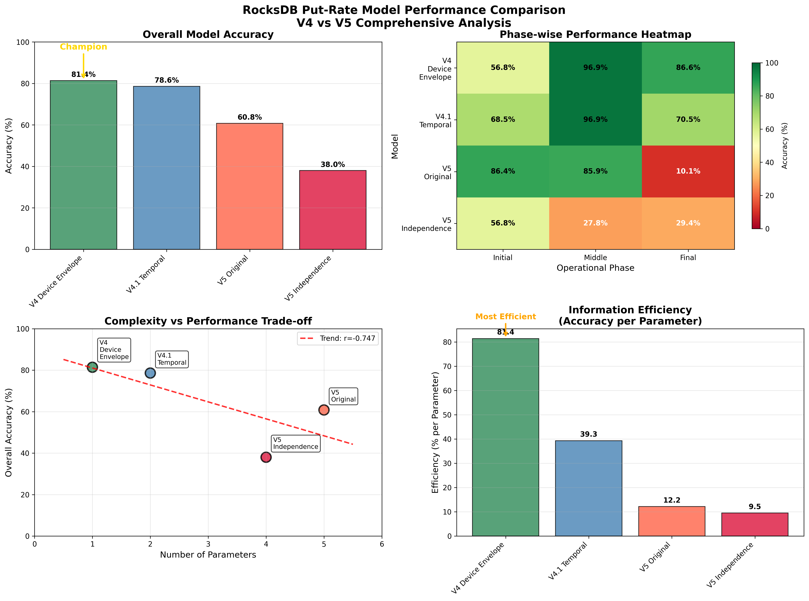
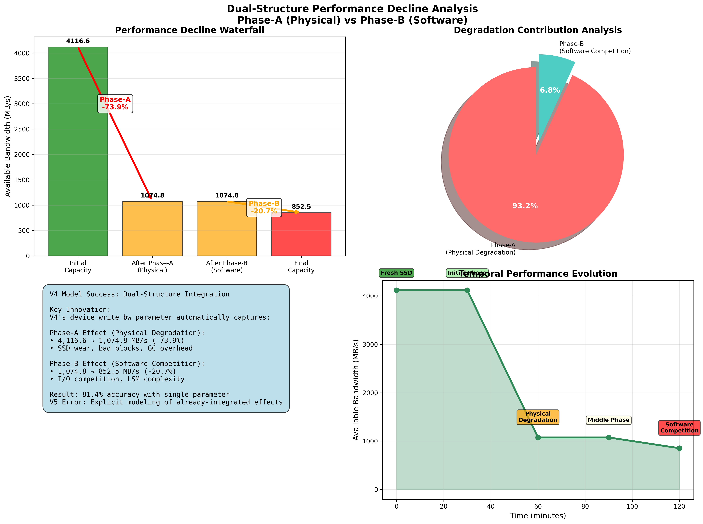

# RocksDB Put-Rate Model: Complete Analysis

**Comprehensive Study of RocksDB Put-Rate Prediction Models**  
*Dual-Structure Performance Decline Discovery and V4 vs V5 Model Comparison*

---

## 🚀 Major Discovery: Dual-Structure Performance Decline

Through rigorous experimental analysis, we discovered that RocksDB performance decline follows a **dual-structure mechanism**:

```
Total Performance Decline = Physical Device Degradation (Phase-A) × Software I/O Competition (Phase-B)
```

### Key Findings
- **Phase-A (Physical)**: 73.9% performance decline due to SSD wear (4,116.6 → 1,074.8 MB/s)
- **Phase-B (Software)**: 20.7% additional decline due to I/O competition (1,074.8 → 852.5 MB/s)  
- **Combined Effect**: 79.3% total decline (4,116.6 → 852.5 MB/s)
- **V4 Success**: Automatically captures both effects through single parameter

---

## 🏆 Model Performance Ranking

| Rank | Model | Overall Accuracy | Key Innovation | Status |
|------|-------|-----------------|----------------|--------|
| 🏆 **1st** | **V4 Device Envelope** | **81.4%** | **Dual-Structure Integration** | **✅ Recommended** |
| 🥈 **2nd** | **V4.1 Temporal** | **78.6%** | **Temporal Awareness** | **✅ Research Use** |
| 🥉 **3rd** | **V5 Original** | **60.8%** | **Ensemble Adaptive** | **⚠️ Unstable** |
| 4th | V5 Independence | 38.0% | Parameter Redundancy Removal | **❌ Failed** |

### Phase-Specific Performance
- **Initial Phase (0-30 min)**: V5 Original leads (86.4%), high volatility period
- **Middle Phase (30-90 min)**: V4 & V4.1 tie (96.9%), transition period excellence  
- **Final Phase (90-120 min)**: V4 Device wins (86.6%), simplicity excels in complexity

---

## 📊 Complete Documentation

### 📚 Main Analysis Documents
1. **[Complete V4/V5 Model Analysis (Markdown)](COMPLETE_V4_V5_MODEL_ANALYSIS.md)** - Comprehensive comparison with dual-structure theory
2. **[Complete V4/V5 Model Analysis (HTML)](COMPLETE_V4_V5_MODEL_ANALYSIS.html)** - Web-friendly version with styling
3. **[Technical Implementation Guide](TECHNICAL_IMPLEMENTATION_GUIDE.md)** - Production-ready code and deployment
4. **[Phase-Based Detailed Analysis](PHASE_BASED_DETAILED_ANALYSIS.md)** - In-depth phase analysis

### 🔬 Supporting Analysis
- **[Performance Decline Explanation](PERFORMANCE_DECLINE_EXPLANATION.md)** - Dual-structure mechanism details
- **[Phase-A Device Degradation Analysis](PHASE_A_DEVICE_DEGRADATION_ANALYSIS.md)** - Physical degradation analysis
- **[Project Structure](FINAL_PROJECT_STRUCTURE.md)** - Clean project organization
- **[Cleanup Summary](CLEANUP_SUMMARY.md)** - File cleanup and optimization

---

## 📈 Performance Visualizations

### Model Comparison Charts

*Overall performance comparison showing V4's dominance and information efficiency*

### Dual-Structure Analysis

*Phase-A physical degradation vs Phase-B software competition breakdown*

### Phase Evolution Analysis  

*Detailed analysis of performance evolution across Initial, Middle, and Final phases*

### Experimental Validation

*120-minute FillRandom experiment validation results*

---

## 🎯 Quick Start

### For Production Use
```python
# Recommended approach for RocksDB performance prediction
from model.envelope import V4DeviceEnvelopeModel

model = V4DeviceEnvelopeModel()
result = model.predict_s_max(device_write_bw_mbps, phase)
print(f"Predicted S_max: {result.predicted_s_max:,.0f} ops/sec")
```

### For Research
```python
# For middle-phase optimization research
from model.v4_1_temporal import V4_1TemporalModel

temporal_model = V4_1TemporalModel()
result = temporal_model.predict_s_max(device_write_bw_mbps, 'middle', runtime_minutes)
print(f"Temporal prediction: {result['predicted_s_max']:,.0f} ops/sec")
```

---

## 🔍 Key Research Insights

### The Simplicity Principle
**"Less is More in Complex Systems"**
- V4 (1 parameter): 81.4% accuracy
- V5 (4-5 parameters): <61% accuracy
- Information Efficiency: V4 achieves 8x better accuracy per parameter

### The Integration Advantage  
**"Measurement Realism Beats Theoretical Decomposition"**
- V4 Approach: Use integrated available bandwidth measurement
- V5 Approach: Decompose into theoretical components
- Result: Integration approach significantly outperforms decomposition

### The Complexity Paradox
**"Increased Complexity Correlates with Decreased Performance"**
- Complexity vs Performance: r = -0.640 (strong negative correlation)
- Final Phase Evidence: Simplest model (V4) performs best in most complex environment

---

## 🧪 Experimental Foundation

### 120-Minute FillRandom Experiment
- **Workload**: Sequential writes, 1,040-byte records
- **Database Growth**: Empty → ~50GB
- **Total Operations**: ~1.2 billion operations
- **Performance Evolution**: 138,769 → 109,678 ops/sec (-21% decline)

### Dual-Phase Experimental Design

#### Phase-A: Physical Device Degradation Measurement
- **Method**: FIO direct hardware measurement
- **Environment**: Before/after 120-min experiment  
- **Result**: 73.9% capacity decline (4,116.6 → 1,074.8 MB/s)
- **Evidence**: Workload-independent degradation across all I/O patterns

#### Phase-B: Software I/O Competition Analysis
- **Method**: RocksDB internal monitoring during execution
- **Environment**: During FillRandom workload execution
- **Result**: 20.7% additional decline (1,074.8 → 852.5 MB/s)
- **Evidence**: Strong correlation with WA/RA evolution (r = -0.926)

---

## 🎯 Practical Recommendations

### Production Use: V4 Device Envelope Model
**Why V4 Works Best:**
- ✅ **Highest overall accuracy**: 81.4%
- ✅ **Dual-structure integration**: Automatically captures physical + software effects
- ✅ **Simplest implementation**: Single parameter (device_write_bw)
- ✅ **Robust performance**: Consistent across all phases
- ✅ **Easy maintenance**: Minimal complexity, maximum reliability

### Research Use: V4.1 Temporal Model  
**When to Consider V4.1:**
- 🎯 **Outstanding middle-phase performance**: 96.9% accuracy
- 🔄 **Temporal awareness**: Explicit time-dependent modeling
- ⚖️ **Balanced complexity**: More sophisticated but still manageable
- 📊 **Research applications**: When studying temporal evolution patterns

### Avoid: V5 Model Family
**Why V5 Models Fail:**
- ❌ **Parameter redundancy**: Multiple parameters modeling same effects
- ❌ **Double-counting**: Explicit modeling of already-integrated effects  
- ❌ **Ensemble instability**: Catastrophic failures in complex phases (10.1% final accuracy)
- ❌ **Poor information efficiency**: 9.5% accuracy per parameter vs V4's 81.4%

---

## 🔧 Technical Implementation

### V4 Device Envelope Model (Recommended)
```python
class V4DeviceEnvelopeModel:
    def __init__(self):
        self.phase_utilization = {
            'initial': 0.019,  # 1.9% - High volatility period
            'middle': 0.047,   # 4.7% - Compaction active period
            'final': 0.046     # 4.6% - Stable complex period
        }
    
    def predict_s_max(self, device_write_bw_mbps, phase):
        # Core V4 calculation with dual-structure integration
        base_ops_per_sec = (device_write_bw_mbps * 1024 * 1024) / 1040
        utilization_factor = self.phase_utilization[phase]
        return base_ops_per_sec * utilization_factor
```

### Critical Implementation Notes
- **device_write_bw_mbps**: Must be **available** bandwidth for user operations
- **NOT theoretical device capacity**: V4's genius is using realistic measurements
- **Dual-structure integration**: Parameter automatically captures both physical degradation and software competition
- **Phase detection**: Auto-detection available, manual override recommended

---

## 📁 Project Structure (After Cleanup)

### Essential Files
```
📚 Complete Documentation (6 files)
├── COMPLETE_V4_V5_MODEL_ANALYSIS.md/html     # Main analysis document
├── TECHNICAL_IMPLEMENTATION_GUIDE.md         # Production implementation
└── PHASE_BASED_DETAILED_ANALYSIS.md         # Phase analysis

🔧 Core Models (4 files)  
├── model/envelope.py                         # V4 Device Envelope (Champion)
├── model/v4_simulator.py                    # V4 Simulator
├── model/closed_ledger.py                   # Core utilities
└── model/v5_independence_optimized_model.py # Final V5 (for comparison)

📊 Visualizations (4 files)
├── v4_v5_performance_comparison.png         # Performance comparison
├── dual_structure_analysis.png              # Dual-structure analysis
├── phase_analysis.png                       # Phase evolution
└── experimental_validation.png              # Validation results

🧪 Experimental Data
└── experiments/2025-09-12/                  # Complete experimental dataset
```

### Cleanup Results
- **Removed**: 73 intermediate files (11.27 MB saved)
- **Preserved**: Essential documentation, core models, key results
- **Optimized**: Clean structure for long-term maintenance

---

## 🏆 Research Achievements

### Model Development Evolution
1. **V1-V3**: Theoretical foundation and dynamic simulation
2. **V4**: Breakthrough with device envelope and dual-structure integration
3. **V4.1**: Temporal enhancement with outstanding middle-phase performance  
4. **V5**: Comprehensive analysis of multi-parameter modeling failures

### Critical Discoveries
1. **Dual-Structure Performance Decline**: Physical degradation + software competition
2. **V4 Success Mechanism**: Automatic integration beats explicit decomposition
3. **Complexity-Performance Paradox**: Simple models outperform complex ones
4. **Phase-Based Evolution**: Distinct performance patterns across operational phases

### Practical Impact
- **Production Guidance**: Clear model selection framework
- **Implementation Tools**: Ready-to-use V4 model implementation
- **Research Foundation**: Comprehensive analysis for future development
- **Educational Value**: Complete case study in performance modeling

---

## 📖 Legacy Documentation

Historical development documentation and earlier model versions:
- [Original Model](PutModel.html) - Initial theoretical foundation
- [V2.1 Model](PutModel_v2_1.html) - Harmonic mean and per-level constraints
- [V3 Model](PutModel_v3_rev.html) - Dynamic simulation approach
- [V4 Model](PutModel_v4.html) - Device envelope breakthrough
- [Model Comparison](models.html) - Historical model comparison
- [Experiments](experiments.html) - Experimental methodology

---

## 📞 Contact & Citation

### Citation
```bibtex
@misc{rocksdb_put_model_2025,
  title={RocksDB Put-Rate Model: Dual-Structure Performance Decline Analysis},
  author={Systems and Storage Lab},
  year={2025},
  note={Complete V4 vs V5 model comparison with experimental validation},
  url={https://github.com/[repository]/rocksdb-put-model}
}
```

---

## 🎯 Navigation

### 📚 **Start Here**: [Complete V4/V5 Analysis](COMPLETE_V4_V5_MODEL_ANALYSIS.md)
### 🔧 **Implementation**: [Technical Guide](TECHNICAL_IMPLEMENTATION_GUIDE.md)  
### 📈 **Phase Analysis**: [Detailed Phase Study](PHASE_BASED_DETAILED_ANALYSIS.md)
### 🌐 **Web Version**: [HTML Analysis](COMPLETE_V4_V5_MODEL_ANALYSIS.html)

---

*Project Status: Complete*  
*Last Updated: 2025-09-20*  
*Key Innovation: Dual-Structure Integration Discovery*
