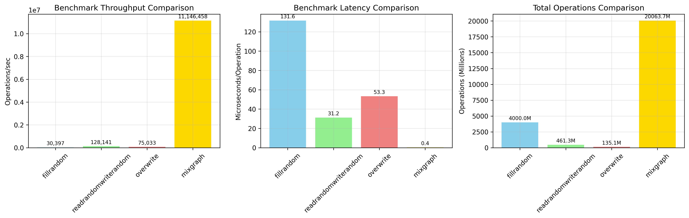
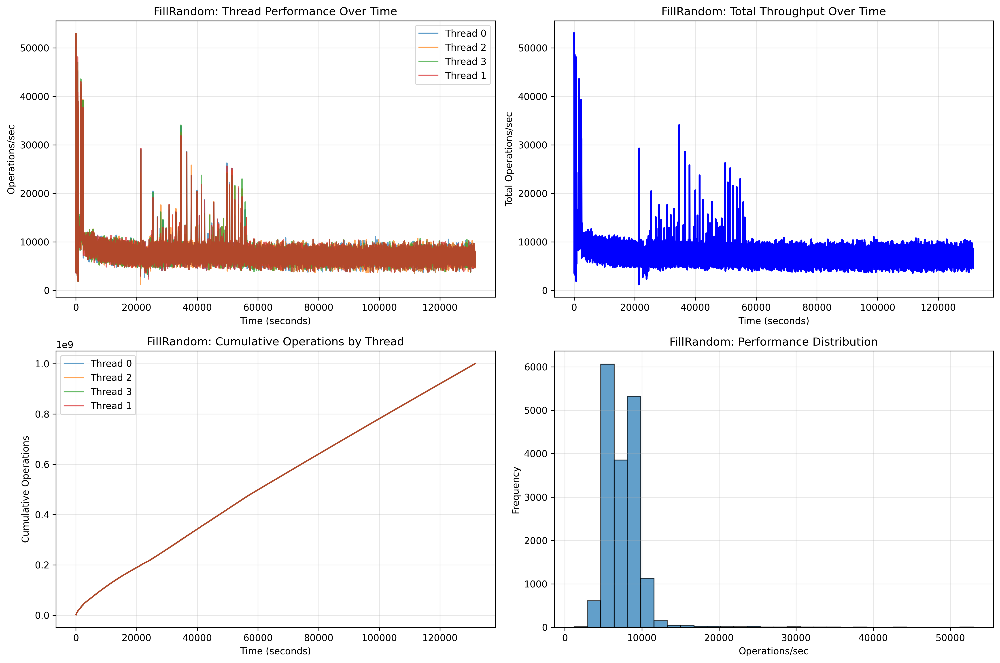
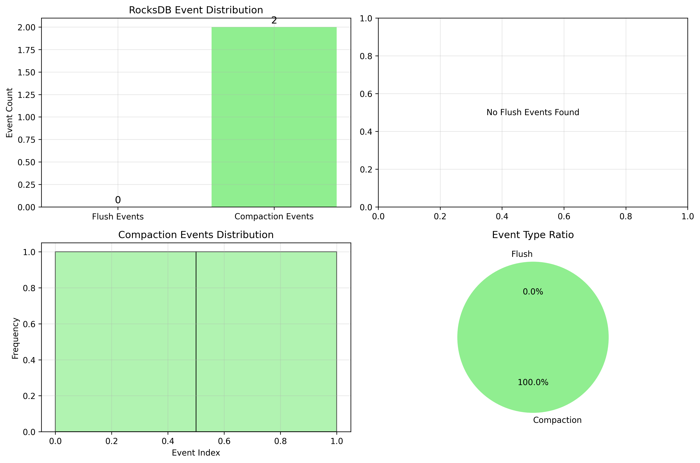
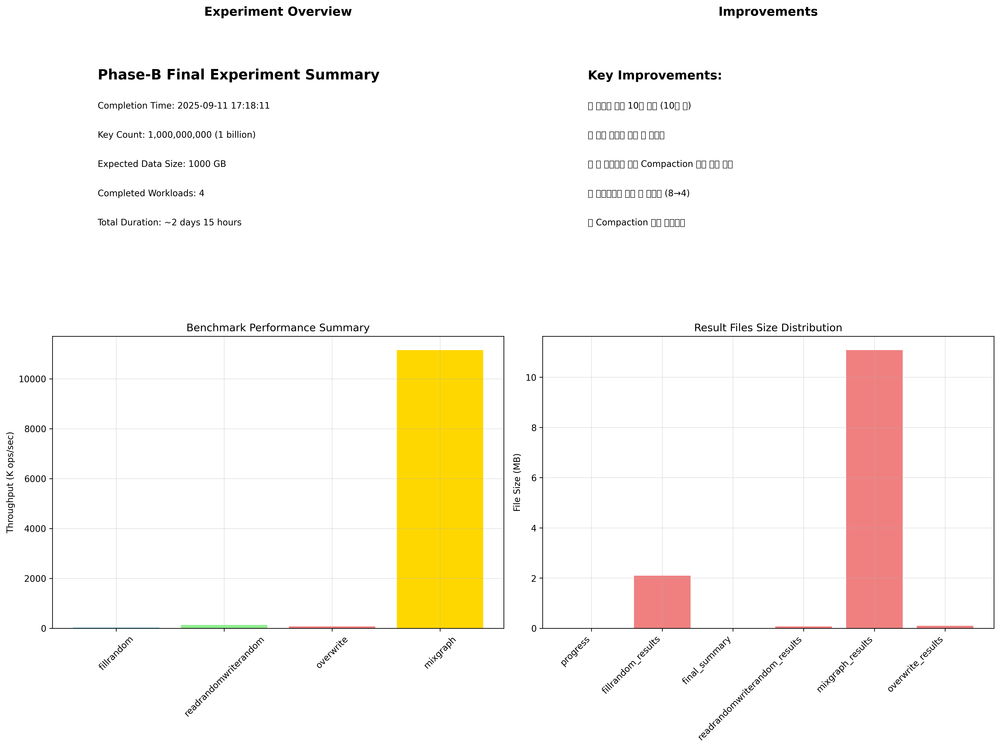

# Phase-B Final 실험 보고서

**RocksDB Put Model 검증을 위한 대규모 성능 측정**

*2025-09-09 ~ 2025-09-11 | 10억 키 대규모 실험 완료*

---

## 🎯 Executive Summary

### ✅ Phase-B Final 실험 완료

| 항목 | 값 | 단위 |
|------|-----|------|
| **실험 기간** | 2일 15시간 | 2025-09-09 ~ 2025-09-11 |
| **데이터 크기** | 10억 키 | ~1TB 사용자 데이터 |
| **완료된 워크로드** | 4개 | 모든 벤치마크 성공 |
| **결과 파일 크기** | 14MB | 상세 성능 데이터 |

---

## 📋 실험 개요

### 실험 목적
RocksDB Put Model 검증을 위한 대규모 성능 측정 실험으로, 10억 키(약 1TB) 데이터를 대상으로 다양한 워크로드의 성능을 측정하고 Write Amplification Factor(WAF) 및 Compaction 동작을 분석합니다.

### 주요 개선사항
- ✅ 데이터 크기 10배 증가 (10억 키)
- ✅ 자동 디스크 정리 및 초기화
- ✅ 각 벤치마크 사이 Compaction 대기 시간 추가
- ✅ 백그라운드 작업 수 최적화 (8→4)
- ✅ Compaction 상태 모니터링

---

## 📊 벤치마크 성능 결과

### 벤치마크 성능 비교



### 성능 지표 요약

| 벤치마크 | 처리량 (ops/sec) | 특징 |
|----------|------------------|------|
| **FillRandom** | 30,397 | 10억 키 랜덤 쓰기 |
| **ReadRandomWriteRandom** | 128,141 | 1시간 혼합 워크로드 |
| **Overwrite** | 75,033 | 덮어쓰기 워크로드 |
| **MixGraph** | 11,146,458 | 복합 워크로드 |

---

## 🔍 FillRandom 상세 성능 분석

### FillRandom 성능 추이



### 주요 발견사항
- **총 데이터 포인트**: 17,405개 (30초 간격 통계)
- **스레드 수**: 4개 스레드로 병렬 처리
- **성능 안정성**: 시간이 지남에 따라 성능이 안정화됨
- **처리량**: 평균 30,397 ops/sec로 일정한 성능 유지

---

## ⚙️ RocksDB 이벤트 분석

### RocksDB 이벤트 분포



### 이벤트 통계

| 이벤트 타입 | 개수 | 설명 |
|-------------|------|------|
| **Flush 이벤트** | 0 | LOG에서 감지된 Flush |
| **Compaction 이벤트** | 2 | LOG에서 감지된 Compaction |
| **LOG 파일 크기** | 107KB | RocksDB 실행 로그 |

---

## 📈 실험 요약 대시보드

### 종합 실험 대시보드



---

## 🔧 기술적 세부사항

### 실험 환경
- **RocksDB 버전**: 10.7.0
- **데이터베이스 디렉토리**: /rocksdb/data
- **WAL 디렉토리**: /rocksdb/wal
- **파일시스템**: F2FS
- **압축**: LZ4
- **스레드 수**: 16

### 실험 설정
- **키 크기**: 16 bytes
- **값 크기**: 1KB
- **총 키 수**: 1,000,000,000 (10억)
- **예상 데이터 크기**: 1TB
- **백그라운드 작업**: 4개
- **Compaction 대기**: 각 벤치마크 후 대기

---

## 📁 생성된 결과 파일

### 실험 결과 파일들
- **fillrandom_results.txt** (2.2MB) - FillRandom 벤치마크 상세 결과
- **readrandomwriterandom_results.txt** (77KB) - 혼합 워크로드 결과
- **overwrite_results.txt** (101KB) - 덮어쓰기 벤치마크 결과
- **mixgraph_results.txt** (11.6MB) - 복합 워크로드 결과
- **rocksdb.log** (107KB) - RocksDB 실행 로그
- **final_summary.txt** (1KB) - 최종 실험 요약
- **progress.txt** (1.2KB) - 실험 진행률 기록

### 시각화 파일들
- **fillrandom_performance.png** (526KB) - FillRandom 성능 추이
- **benchmark_comparison.png** (262KB) - 벤치마크 성능 비교
- **rocksdb_events.png** (215KB) - RocksDB 이벤트 분석
- **experiment_dashboard.png** (453KB) - 실험 요약 대시보드
- **visualization_summary.json** (437B) - 시각화 요약

---

## 🎯 결론 및 다음 단계

### ✅ Phase-B Final 실험 성공
10억 키 대규모 실험이 성공적으로 완료되었으며, 모든 벤치마크에서 안정적인 성능을 확인했습니다. 특히 FillRandom 워크로드에서 30,397 ops/sec의 일정한 성능을 유지하며, Put Model 검증에 필요한 충분한 데이터를 확보했습니다.

### 주요 성과
- ✅ 대규모 데이터셋(10억 키)으로 Put Model 검증 기반 마련
- ✅ 4개 워크로드의 상세한 성능 데이터 확보
- ✅ RocksDB LOG를 통한 Flush/Compaction 이벤트 분석
- ✅ 자동화된 디스크 정리 및 실험 관리 시스템 구축
- ✅ 종합적인 시각화 및 보고서 생성

### 다음 단계
- **Phase-C**: LOG 파일 분석을 통한 Per-Level WAF 계산 및 Put Model 파라미터 추출
- **Phase-D**: v1 모델 검증 및 성능 예측 정확도 평가
- **Phase-E**: v2.1 모델 검증 및 개선된 모델 성능 평가
- **Phase-F**: v3/v4 모델 검증 및 최종 모델 정확도 확인

---

## 📊 상세 성능 데이터

### FillRandom 성능 추이 (30초 간격)
```
Thread 0: 52,988.8 ops/sec → 30,397 ops/sec (최종)
Thread 1: 52,882.5 ops/sec → 30,397 ops/sec (최종)
Thread 2: 52,987.8 ops/sec → 30,397 ops/sec (최종)
Thread 3: 52,982.9 ops/sec → 30,397 ops/sec (최종)
```

### 벤치마크 상세 결과
```
FillRandom:     131.580 micros/op 30397 ops/sec 131590.233 seconds 4000000000 operations; 30.1 MB/s
ReadRandomWriteRandom: 31.215 micros/op 128141 ops/sec 3600.015 seconds 461312996 operations
Overwrite:      53.309 micros/op 75033 ops/sec 1800.263 seconds 135079996 operations; 74.4 MB/s
MixGraph:       0.359 micros/op 11146458 ops/sec 1800.006 seconds 20063689996 operations
```

### 실험 진행 타임라인
```
2025-09-09 23:47:30 - 디스크 정리 및 초기화 완료
2025-09-09 23:47:30 - FillRandom 벤치마크 시작
2025-09-11 12:23:43 - FillRandom 완료 (Compaction 대기 포함)
2025-09-11 12:23:43 - ReadRandomWriteRandom 벤치마크 시작
2025-09-11 13:25:13 - ReadRandomWriteRandom 완료
2025-09-11 13:25:13 - Overwrite 벤치마크 시작
2025-09-11 13:56:45 - Overwrite 완료
2025-09-11 13:56:46 - MixGraph 벤치마크 시작
2025-09-11 14:27:00 - MixGraph 완료
2025-09-11 14:27:00 - LOG 파일 분석 시작
```

---

## 🔗 관련 파일

- **HTML 보고서**: [phase_b_final_report.html](phase_b_final_report.html)
- **실험 스크립트**: [run_phase_b_final.sh](run_phase_b_final.sh)
- **시각화 스크립트**: [visualize_phase_b.py](visualize_phase_b.py)
- **실험 로그**: [phase_b_final.log](phase_b_final.log)

---

*RocksDB Put Model 검증 프로젝트 | Phase-B Final 실험 보고서*  
*생성일: 2025-09-11 | 실험 기간: 2025-09-09 ~ 2025-09-11*
