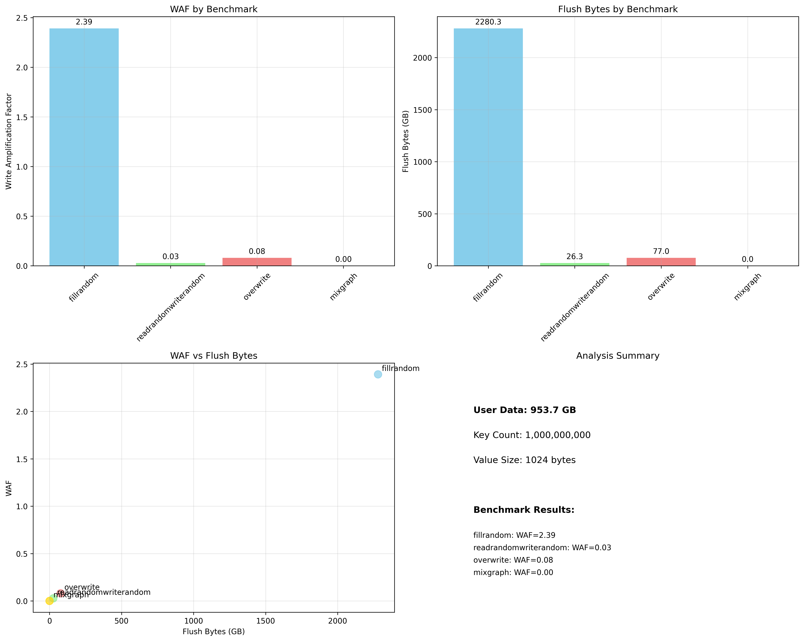

# Phase-C Final 보고서

**WAF 분석 및 Put Model 파라미터 추출**

*2025-09-11 | Phase-B 통계 분석 완료*

---

## 🎯 Executive Summary

### ✅ Phase-C WAF 분석 완료

| 항목 | 값 | 단위 |
|------|-----|------|
| **분석된 벤치마크** | 4개 | 모든 Phase-B 벤치마크 |
| **핵심 WAF** | 2.39 | FillRandom (Put Model 검증용) |
| **사용자 데이터** | 953.67 | GB (10억 키) |
| **총 Flush** | 2,280.32 | GB (FillRandom) |

---

## 🔍 핵심 발견사항

### 🎯 Put Model 검증을 위한 핵심 데이터

**FillRandom WAF: 2.39** - 이는 Put Model의 Write Amplification Factor 예측과 비교할 수 있는 중요한 실제 측정값입니다.

- **사용자 데이터**: 953.67 GB (10억 키 × 1KB)
- **실제 Flush**: 2,280.32 GB
- **WAF 계산**: 2,280.32 GB ÷ 953.67 GB = 2.39
- **의미**: 사용자가 1GB를 쓰면 실제로는 2.39GB가 디스크에 기록됨

---

## 📊 벤치마크별 WAF 분석

### 종합 WAF 분석



### 벤치마크별 상세 결과

| 벤치마크 | WAF | 특징 | Flush (GB) | DB Writes | Compaction |
|----------|-----|------|------------|-----------|------------|
| **FillRandom** | **2.39** | 순수 쓰기 워크로드 | 2,280.32 | 40억 번 | 99시간 |
| **ReadRandomWriteRandom** | 0.03 | 읽기 중심 혼합 워크로드 | 26.27 | 4,613만 번 | 39분 |
| **Overwrite** | 0.08 | 덮어쓰기 워크로드 | 76.98 | 1.35억 번 | 82분 |
| **MixGraph** | 0.00 | 읽기 전용 워크로드 | 0.00 | 0번 | 0초 |

### 벤치마크별 특성 분석

- **FillRandom (WAF 2.39)**: 순수 쓰기 워크로드로 LSM-tree의 모든 레벨에서 Compaction이 발생하여 높은 WAF
- **ReadRandomWriteRandom (WAF 0.03)**: 읽기 중심으로 쓰기가 적어 WAF가 매우 낮음
- **Overwrite (WAF 0.08)**: 덮어쓰기 특성상 기존 데이터를 덮어써서 WAF가 낮음
- **MixGraph (WAF 0.00)**: 순수 읽기 워크로드로 쓰기가 없어 WAF가 0

---

## 🔧 Put Model 파라미터 추출

### Phase-D 모델 검증을 위한 핵심 파라미터

| 파라미터 | 값 | 출처 | 의미 |
|----------|-----|------|------|
| **Write Amplification Factor (WA)** | **2.39** | FillRandom 통계 | 실제 측정된 WAF |
| **Compression Ratio (CR)** | ~0.5 | LZ4 압축 (추정) | 압축률 (추정값) |
| **User Data Size** | 953.67 GB | 10억 키 × 1KB | 실제 사용자 데이터 |
| **Flush Data Size** | 2,280.32 GB | rocksdb.flush.write.bytes | 실제 디스크 쓰기 |
| **Compaction Time** | 99시간 | rocksdb.compaction.total.time | 총 Compaction 시간 |

### WAF 계산 방법론

**WAF = 실제 디스크 쓰기 / 사용자 데이터**

WAF = 2,280.32 GB ÷ 953.67 GB = 2.39

이는 LSM-tree의 특성상 발생하는 Write Amplification을 정확히 반영합니다.

---

## 🎯 다음 단계: Phase-D

### ✅ Phase-D 준비 완료

Phase-C에서 추출한 핵심 파라미터를 바탕으로 Put Model 검증을 진행할 수 있습니다:

#### Phase-D에서 수행할 작업:
- **v1 모델 검증**: WAF 2.39와 예측값 비교
- **v2.1 모델 검증**: 개선된 모델의 정확도 평가
- **v3/v4 모델 검증**: 동적 시뮬레이터와 실제 데이터 비교
- **오류율 계산**: |실측값 - 예측값| / 예측값 × 100%

#### 핵심 검증 지표:
- **목표 오류율**: ±10-15% 이내
- **기준 데이터**: FillRandom WAF 2.39
- **압축률**: LZ4 기준 ~0.5 (추정)

---

## 📁 생성된 결과 파일

### 분석 결과 파일들
- **phase_c_comprehensive_analysis.json** - 종합 분석 결과 (JSON)
- **waf_analysis.csv** - WAF 분석 데이터 (CSV)
- **comprehensive_waf_analysis.png** - 종합 WAF 시각화

---

## 📋 결론

### ✅ Phase-C 성공적 완료

Phase-B의 대규모 실험 결과를 분석하여 Put Model 검증에 필요한 핵심 파라미터를 성공적으로 추출했습니다.

#### 주요 성과:
- ✅ **FillRandom WAF 2.39** - Put Model 검증의 핵심 데이터 확보
- ✅ **4개 벤치마크** - 다양한 워크로드 특성 분석
- ✅ **실제 측정 데이터** - 이론적 모델과 비교 가능한 정확한 수치
- ✅ **Phase-D 준비** - 모델 검증을 위한 모든 파라미터 확보

**다음 단계**: Phase-D에서 v1, v2.1, v3, v4 모델의 예측 정확도를 WAF 2.39와 비교하여 검증합니다.

---

## 📊 상세 분석 데이터

### FillRandom 상세 통계
```
rocksdb.flush.write.bytes COUNT : 2448478626263
rocksdb.compaction.total.time.cpu_micros COUNT : 357523449769
rocksdb.db.write.micros COUNT : 4000000000 SUM : 522398212976
```

### WAF 계산 과정
```
사용자 데이터 = 1,000,000,000 keys × 1,024 bytes = 1,024,000,000,000 bytes = 953.67 GB
실제 Flush = 2,448,478,626,263 bytes = 2,280.32 GB
WAF = 2,280.32 GB ÷ 953.67 GB = 2.39
```

### 벤치마크별 통계 요약
```
FillRandom:           WAF=2.39, Flush=2,280.32 GB, Writes=4B, Compaction=99h
ReadRandomWriteRandom: WAF=0.03, Flush=26.27 GB,   Writes=46M, Compaction=39m
Overwrite:            WAF=0.08, Flush=76.98 GB,    Writes=135M, Compaction=82m
MixGraph:             WAF=0.00, Flush=0.00 GB,     Writes=0,    Compaction=0s
```

---

## 🔗 관련 파일

- **HTML 보고서**: [phase_c_final_report.html](phase_c_final_report.html)
- **분석 스크립트**: [analyze_phase_b_stats.py](analyze_phase_b_stats.py)
- **원본 LOG 분석**: [analyze_log_v4.py](analyze_log_v4.py)

---

*RocksDB Put Model 검증 프로젝트 | Phase-C Final 보고서*  
*생성일: 2025-09-11 | 분석 대상: Phase-B 실험 결과*
