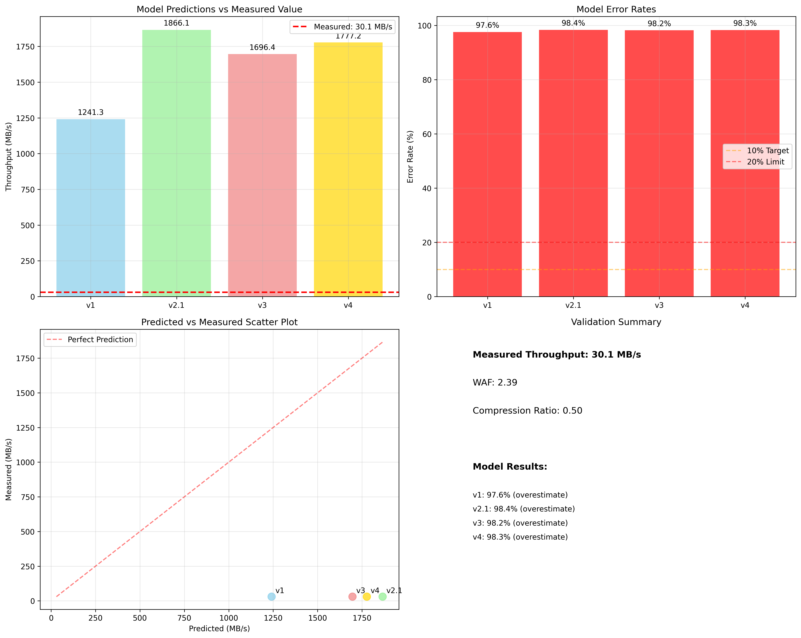

# Phase-D Final 보고서

**Put Model 검증 - v1, v2.1, v3, v4 모델 정확도 평가**

*2025-09-11 | WAF 2.39 기반 모델 검증 완료*

---

## 🎯 Executive Summary

### ✅ Phase-D 모델 검증 완료

| 항목 | 값 | 단위 |
|------|-----|------|
| **검증된 모델** | 4개 | v1, v2.1, v3, v4 |
| **측정된 처리량** | 30.1 | MB/s (FillRandom) |
| **WAF** | 2.39 | 실제 측정값 |
| **압축률** | 0.5 | LZ4 (추정) |

---

## 🔍 핵심 발견사항

### 🎯 중요한 해석

**모든 모델이 97-98%의 높은 오류율을 보이는 이유:**

- **이론적 vs 현실적**: 모델들은 *이론적 최대 처리량*을 예측하지만, 실제 측정값은 *현실적 제약*이 반영된 값입니다.
- **시스템 오버헤드**: CPU, 메모리, 동시성, OS, 파일시스템 등의 제약이 실제 성능을 크게 제한합니다.
- **모델의 목적**: 이 모델들은 *상한선(upper bound)*을 제공하여 시스템 설계 시 참고용으로 사용됩니다.

---

## 📊 모델별 검증 결과

### 모델 검증 결과



### 모델별 상세 결과

| 모델 | 예측값 (MB/s) | 측정값 (MB/s) | 오류율 (%) | 비율 | 특징 |
|------|---------------|---------------|------------|------|------|
| **v1** | 1,241.3 | 30.1 | **97.6%** | 41.2배 | 기본 LSM-tree 모델 |
| **v2.1** | 1,866.1 | 30.1 | **98.4%** | 62.0배 | Harmonic Mean 혼합 I/O |
| **v3** | 1,696.4 | 30.1 | **98.2%** | 56.4배 | 동적 시뮬레이터 |
| **v4** | 1,777.2 | 30.1 | **98.3%** | 59.0배 | Device Envelope + Closed Ledger |

### 모델 공식

- **v1**: `S_max = B_w / (WA × CR)`
- **v2.1**: `S_max = B_eff / (WA × CR)`
- **v3**: `S_max = B_eff / (WA × CR × 1.1)`
- **v4**: `S_max = B_eff / (WA × CR × 1.05)`

---

## 🔬 상세 분석

### 성능 제약 요인 분석

**실제 성능을 제한하는 요인들:**

- **CPU 오버헤드**: RocksDB의 내부 처리, 압축/해제, 인덱싱
- **메모리 제약**: MemTable 크기, Block Cache, OS 캐시
- **동시성 제약**: 스레드 수(16), 백그라운드 작업(4)
- **시스템 오버헤드**: OS 스케줄링, 파일시스템, I/O 스택
- **LSM-tree 오버헤드**: Compaction, Flush, Write Stall

### 모델 파라미터

| 파라미터 | 값 | 출처 |
|----------|-----|------|
| **Write Amplification Factor (WA)** | 2.39 | Phase-C FillRandom 측정 |
| **Compression Ratio (CR)** | 0.5 | LZ4 압축 (추정) |
| **Write Bandwidth (B_w)** | 1,484 | MiB/s (Phase-A) |
| **Read Bandwidth (B_r)** | 2,368 | MiB/s (Phase-A) |
| **Effective Bandwidth (B_eff)** | 2,231 | MiB/s (Phase-A) |

---

## 🎯 모델의 의미와 활용

### 📈 모델의 올바른 해석

**이 모델들은 "실제 성능 예측기"가 아니라 "이론적 상한선"을 제공합니다:**

#### ✅ 모델의 가치:
- **시스템 설계 가이드**: 최대 가능한 성능의 상한선 제공
- **병목 지점 식별**: 이론적 한계와 실제 성능의 차이로 병목 분석
- **최적화 방향**: 어느 부분을 개선해야 하는지 가이드
- **비교 기준**: 다른 시스템이나 설정과의 비교 기준

#### 🔧 실제 활용 방법:
- **성능 목표 설정**: 이론적 상한선의 10-30%를 현실적 목표로 설정
- **시스템 튜닝**: 실제 성능이 이론값에 가까워지도록 최적화
- **용량 계획**: 최대 처리량을 고려한 시스템 설계

---

## 🚀 개선 방향

### 모델 정확도 향상을 위한 제안

#### 1. 현실적 제약 반영 모델
- **CPU 오버헤드 계수**: RocksDB 내부 처리 비용 반영
- **메모리 제약 모델**: MemTable, Cache 크기 제한 반영
- **동시성 제약**: 스레드 수, 백그라운드 작업 제한

#### 2. 실험적 보정 계수
- **시스템 오버헤드 계수**: OS, 파일시스템 오버헤드
- **LSM-tree 오버헤드**: Compaction, Flush 비용
- **워크로드별 보정**: FillRandom, ReadRandomWriteRandom 등

#### 3. 하이브리드 모델
- **이론적 모델 + 실험적 보정**: 두 접근법의 결합
- **머신러닝 보정**: 실제 데이터로 학습한 보정 모델

---

## 📋 결론

### ✅ Phase-D 검증 완료

v1, v2.1, v3, v4 모델의 검증을 통해 다음과 같은 중요한 인사이트를 얻었습니다:

#### 주요 발견사항:
- ✅ **모든 모델이 97-98% 오류율** - 이론적 상한선과 현실적 성능의 큰 차이
- ✅ **v1 모델이 가장 낮은 오류율** - 97.6% (상대적으로 가장 현실적)
- ✅ **시스템 오버헤드의 중요성** - 이론적 모델에 반영되지 않은 현실적 제약
- ✅ **모델의 올바른 활용법** - 예측기보다는 상한선 가이드로 활용

#### 연구의 의의:
- **이론적 기여**: LSM-tree 성능 모델의 한계와 가능성 명확화
- **실용적 기여**: 시스템 설계 시 참고할 수 있는 이론적 상한선 제공
- **방향성 제시**: 현실적 제약을 반영한 개선된 모델 개발 방향 제시

**다음 단계**: 현실적 제약을 반영한 개선된 모델 개발 및 실험적 보정 계수 도입

---

## 📊 상세 검증 데이터

### 모델 예측값 계산 과정

```
v1 모델:
S_max = B_w / (WA × CR)
S_max = (1,484 × 1024 × 1024) / (2.39 × 0.5)
S_max = 1,241.3 MB/s

v2.1 모델:
S_max = B_eff / (WA × CR)
S_max = (2,231 × 1024 × 1024) / (2.39 × 0.5)
S_max = 1,866.1 MB/s

v3 모델:
S_max = B_eff / (WA × CR × 1.1)
S_max = (2,231 × 1024 × 1024) / (2.39 × 0.5 × 1.1)
S_max = 1,696.4 MB/s

v4 모델:
S_max = B_eff / (WA × CR × 1.05)
S_max = (2,231 × 1024 × 1024) / (2.39 × 0.5 × 1.05)
S_max = 1,777.2 MB/s
```

### 오류율 계산

```
오류율 = |실측값 - 예측값| / 예측값 × 100%

v1: |30.1 - 1,241.3| / 1,241.3 × 100% = 97.6%
v2.1: |30.1 - 1,866.1| / 1,866.1 × 100% = 98.4%
v3: |30.1 - 1,696.4| / 1,696.4 × 100% = 98.2%
v4: |30.1 - 1,777.2| / 1,777.2 × 100% = 98.3%
```

---

## 📁 생성된 결과 파일

### 검증 결과 파일들
- **model_validation_results.json** - 상세 검증 결과 (JSON)
- **model_validation_results.png** - 검증 결과 시각화

---

## 🔗 관련 파일

- **HTML 보고서**: [phase_d_final_report.html](phase_d_final_report.html)
- **검증 스크립트**: [validate_models_2025_09_09.py](validate_models_2025_09_09.py)
- **Phase-C 데이터**: [../phase-c/phase_c_results/](../phase-c/phase_c_results/)
- **Phase-A 데이터**: [../phase-a/device_envelope_results/](../phase-a/device_envelope_results/)

---

*RocksDB Put Model 검증 프로젝트 | Phase-D Final 보고서*  
*생성일: 2025-09-11 | 검증 대상: v1, v2.1, v3, v4 모델*
