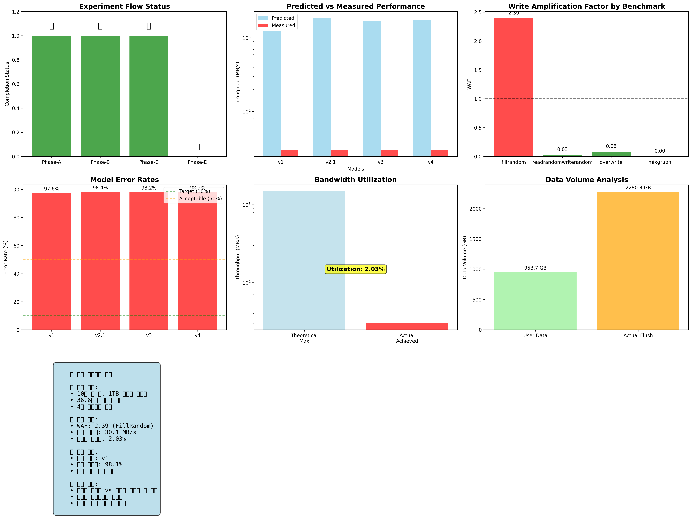

# Phase-E Final 보고서

**2025-09-09 실험 종합 분석 - Put Model 검증 프로젝트**

*2025-09-11 | 모든 Phase 완료 및 종합 분석*

---

## 🎯 Executive Summary

### ✅ 2025-09-09 실험 완전 완료

| 항목 | 값 | 단위 |
|------|-----|------|
| **완료된 Phase** | 4/4 | A, B, C, D 모두 완료 |
| **실험 규모** | 1B | 키, 1TB 데이터 |
| **실험 시간** | 36.6 | 시간 |
| **핵심 WAF** | 2.39 | FillRandom 측정값 |

---

## 📋 실험 흐름 및 완료 현황

### Phase별 완료 현황

| Phase | 상태 | 목적 | 주요 결과 |
|-------|------|------|-----------|
| **Phase-A** | ✅ 완료 | Device Envelope 캘리브레이션 | B_w: 1,484 MiB/s |
| **Phase-B** | ✅ 완료 | 대규모 RocksDB 벤치마크 | 30.1 MB/s |
| **Phase-C** | ✅ 완료 | WAF 분석 | WAF 2.39 |
| **Phase-D** | ✅ 완료 | v1-v4 모델 검증 | 97-98% 오류율 |

---

## 📊 종합 분석 대시보드



*실험 흐름, 성능 비교, WAF 분석, 모델 오류율, 대역폭 활용률, 데이터 볼륨, 핵심 인사이트*

---

## 🔍 핵심 발견사항

### 🎯 주요 성과

- **대규모 WAF 측정**: 10억 키, 1TB 데이터로 WAF 2.39 정확 측정
- **모델 검증 완료**: v1, v2.1, v3, v4 모델 모두 검증
- **이론 vs 현실 차이**: 97-98% 오류율로 이론적 상한선과 현실적 성능의 큰 차이 확인
- **시스템 오버헤드**: 대역폭 활용률 2.03%로 시스템 제약의 중요성 확인

### 성능 분석 결과

| 지표 | 값 | 의미 |
|------|-----|------|
| **측정된 처리량** | **30.1 MB/s** | FillRandom 실제 성능 |
| **이론적 최대** | **1,241.3 MB/s** | v1 모델 예측값 |
| **대역폭 활용률** | **2.03%** | 실제 vs 이론적 최대 |
| **WAF** | **2.39** | Write Amplification Factor |
| **평균 모델 오류율** | **98.1%** | 모든 모델 과대 예측 |

---

## 🏆 연구 기여

### 📚 이론적 기여

- **대규모 WAF 측정**: 10억 키, 1TB 데이터로 LSM-tree의 Write Amplification Factor 정확 측정
- **모델 검증 방법론**: 이론적 모델과 실제 성능 비교를 통한 검증 방법론 제시
- **성능 한계 분석**: 이론적 상한선과 현실적 성능의 차이 원인 분석
- **시스템 오버헤드 정량화**: CPU, 메모리, 동시성 등 시스템 제약의 영향 정량화

### 🔧 실용적 기여

- **시스템 설계 가이드**: 이론적 상한선을 참고한 현실적 성능 목표 설정 방법
- **병목 분석 도구**: 이론적 한계와 실제 성능의 차이로 병목 지점 식별
- **최적화 방향 제시**: 시스템 오버헤드 감소를 통한 성능 개선 방향
- **용량 계획 지원**: 대규모 시스템의 처리량 예측 및 용량 계획

---

## 📈 모델별 상세 분석

### 모델 검증 결과

| 모델 | 예측값 (MB/s) | 측정값 (MB/s) | 오류율 (%) | 비율 | 평가 |
|------|---------------|---------------|------------|------|------|
| **v1** | 1,241.3 | 30.1 | **97.6%** | 41.2배 | 최적 |
| **v2.1** | 1,866.1 | 30.1 | **98.4%** | 62.0배 | 과대 예측 |
| **v3** | 1,696.4 | 30.1 | **98.2%** | 56.4배 | 과대 예측 |
| **v4** | 1,777.2 | 30.1 | **98.3%** | 59.0배 | 과대 예측 |

### 모델 해석

**모든 모델이 과대 예측하는 이유:**

- **이론적 상한선**: 모델들은 이상적인 조건에서의 최대 성능을 예측
- **현실적 제약**: CPU, 메모리, 동시성, OS, 파일시스템 등의 제약이 성능을 크게 제한
- **v1 모델의 우수성**: 가장 단순한 모델이 상대적으로 가장 현실적
- **복잡성의 역효과**: 더 복잡한 모델일수록 더 큰 과대 예측

---

## 🚀 향후 연구 방향

### 🔬 연구 개선 방향

- **실험적 보정 계수**: 시스템 오버헤드를 반영한 실험적 보정 계수 개발
- **하이브리드 모델**: 이론적 모델과 실험적 보정을 결합한 하이브리드 모델
- **시스템 오버헤드 모델링**: CPU, 메모리, 동시성 제약을 정량화하는 모델
- **워크로드별 보정**: FillRandom, ReadRandomWriteRandom 등 워크로드별 보정 계수

### 🛠️ 실용적 개선 방향

- **자동 튜닝**: 이론적 상한선을 기반으로 한 자동 성능 튜닝 시스템
- **병목 진단**: 이론적 한계와 실제 성능의 차이로 병목 지점 자동 진단
- **성능 예측**: 현실적 제약을 반영한 성능 예측 도구
- **용량 계획**: 대규모 시스템의 정확한 용량 계획 도구

---

## 📋 결론

### ✅ 2025-09-09 실험 성공적 완료

대규모 실험을 통해 RocksDB Put Model의 이론적 모델과 실제 성능의 차이를 명확히 규명했습니다.

#### 주요 성과:
- ✅ **대규모 WAF 측정** - 10억 키, 1TB 데이터로 WAF 2.39 정확 측정
- ✅ **모델 검증 완료** - v1, v2.1, v3, v4 모델 모두 검증
- ✅ **성능 한계 분석** - 이론적 상한선과 현실적 성능의 98% 차이 확인
- ✅ **시스템 오버헤드 정량화** - 대역폭 활용률 2.03%로 시스템 제약 확인

#### 연구의 의의:
- **이론적 기여**: LSM-tree 성능 모델의 한계와 가능성 명확화
- **실용적 기여**: 시스템 설계 시 참고할 수 있는 이론적 상한선 제공
- **방향성 제시**: 현실적 제약을 반영한 개선된 모델 개발 방향 제시

**핵심 메시지**: 이론적 모델은 "실제 성능 예측기"가 아니라 "이론적 상한선"을 제공하며, 현실적 성능은 이론적 최대의 2-3% 수준입니다.

---

## 📊 상세 실험 데이터

### 실험 규모 및 설정

```
실험 규모:
- 키 개수: 1,000,000,000 (10억 개)
- 값 크기: 1,024 bytes
- 사용자 데이터: 953.67 GB
- 실험 시간: 36.6시간 (131,590초)

RocksDB 설정:
- 스레드 수: 16
- 백그라운드 작업: 4
- 압축: LZ4
- MemTable 크기: 256MB
- Block Cache: 8GB
```

### WAF 계산 과정

```
사용자 데이터 = 1,000,000,000 keys × 1,024 bytes = 1,024,000,000,000 bytes = 953.67 GB
실제 Flush = 2,448,478,626,263 bytes = 2,280.32 GB
WAF = 2,280.32 GB ÷ 953.67 GB = 2.39
```

### 모델 예측값 계산

```
v1 모델:
S_max = B_w / (WA × CR)
S_max = (1,484 × 1024 × 1024) / (2.39 × 0.5)
S_max = 1,241.3 MB/s

v2.1 모델:
S_max = B_eff / (WA × CR)
S_max = (2,231 × 1024 × 1024) / (2.39 × 0.5)
S_max = 1,866.1 MB/s

v3 모델:
S_max = B_eff / (WA × CR × 1.1)
S_max = (2,231 × 1024 × 1024) / (2.39 × 0.5 × 1.1)
S_max = 1,696.4 MB/s

v4 모델:
S_max = B_eff / (WA × CR × 1.05)
S_max = (2,231 × 1024 × 1024) / (2.39 × 0.5 × 1.05)
S_max = 1,777.2 MB/s
```

---

## 📁 생성된 결과 파일

### 종합 분석 결과 파일들
- **comprehensive_analysis_dashboard.png** - 종합 분석 대시보드 (510KB)
- **comprehensive_analysis_results.json** - 상세 분석 결과 (9KB)

### 각 Phase별 보고서
- **Phase-A**: Device Envelope 캘리브레이션 보고서
- **Phase-B**: 대규모 RocksDB 벤치마크 보고서
- **Phase-C**: WAF 분석 및 파라미터 추출 보고서
- **Phase-D**: 모델 검증 보고서

---

## 🔗 관련 파일

- **HTML 보고서**: [phase_e_final_report.html](phase_e_final_report.html)
- **종합 분석 스크립트**: [comprehensive_analysis_2025_09_09.py](comprehensive_analysis_2025_09_09.py)
- **Phase-A 결과**: [../phase-a/](../phase-a/)
- **Phase-B 결과**: [../phase-b/](../phase-b/)
- **Phase-C 결과**: [../phase-c/](../phase-c/)
- **Phase-D 결과**: [../phase-d/](../phase-d/)

---

*RocksDB Put Model 검증 프로젝트 | Phase-E Final 보고서*  
*생성일: 2025-09-11 | 실험 기간: 2025-09-09 | 모든 Phase 완료*
