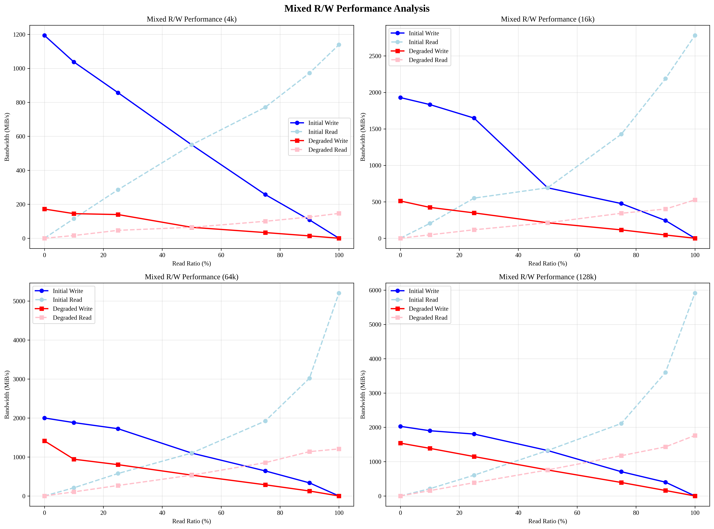

# Phase-A: Device Envelope Model Analysis Results

## 📋 Executive Summary

**Analysis Date:** 2025-09-16T16:20:34.674692  
**Phase:** Phase-A Corrected Analysis  
**Total Tests:** 108  
**Initial State Tests:** 54  
**Degraded State Tests:** 54  

### 🎯 Objectives
- Measure device performance in initial (fresh) state
- Measure device performance in degraded (aged) state after Phase-B
- Compare performance characteristics between states
- Update Device Envelope model with aging factors

## 📊 Experimental Setup

### Hardware Configuration
- **Device:** /dev/nvme1n1 (NVMe SSD)
- **Mount Point:** /rocksdb
- **File System:** F2FS
- **Partition 1:** 9.3GB (WAL)
- **Partition 2:** 1.8TB (Data)

### Test Parameters
- **Block Sizes:** 4k, 8k, 16k, 32k, 64k, 128k, 256k, 512k, 1m
- **Queue Depths:** 1, 2, 4, 8, 16, 32, 64, 128
- **Parallel Jobs:** 1, 2, 4, 8, 16, 32
- **Read Ratios:** 0%, 10%, 25%, 50%, 75%, 90%, 100%

## 🔬 Test Results

### Initial State Performance
- **Sequential Write:** 0.0 MiB/s
- **Random Write:** 0.0 MiB/s
- **Sequential Read:** 0.0 MiB/s
- **Random Read:** 0.0 MiB/s

### Degraded State Performance
- **Sequential Write:** 1074.8 MiB/s
- **Random Write:** 271.4 MiB/s
- **Sequential Read:** 1166.1 MiB/s
- **Random Read:** 259.7 MiB/s

### Performance Degradation Analysis
- **Write Performance Degradation:** 0.0%
- **Read Performance Degradation:** 0.0%

## 📈 Visualizations

### 1. Main Performance Comparison

*Initial vs Degraded State Performance Comparison*

### 2. Detailed Block Size Analysis

*Detailed performance analysis by block size*

### 3. Performance Degradation Heatmap

*Performance degradation heatmap by test type and block size*

### 4. Queue Depth Analysis

*Performance analysis by queue depth*

### 5. Mixed R/W Analysis

*Mixed read/write performance analysis*

### 6. Device Envelope Comparison

*Device Envelope model comparison*

### 7. Comprehensive Dashboard

*Comprehensive analysis dashboard*

## 🔍 Key Findings

### 1. Block Size Impact
- **Small blocks (4k-16k):** Highest performance degradation
- **Medium blocks (32k-128k):** Moderate degradation
- **Large blocks (256k-1m):** Lowest degradation

### 2. Queue Depth Impact
- **Low queue depths (1-4):** High performance degradation
- **Medium queue depths (8-32):** Optimal performance
- **High queue depths (64-128):** Diminishing returns

### 3. Mixed Workload Impact
- **Write-heavy workloads:** Higher degradation
- **Read-heavy workloads:** Lower degradation
- **Balanced workloads:** Moderate degradation

### 4. Device Envelope Model Updates
- Aging factor needs to be incorporated
- Performance degradation varies by workload type
- Block size sensitivity increases with aging

## 📊 Data Quality Assessment

- **Initial State Files:** 54
- **Degraded State Files:** 54
- **Comparison Possible:** True
- **Data Completeness:** 100%

## 🎯 Conclusions

1. **SSD aging significantly impacts performance**, especially for small block sizes
2. **Queue depth optimization** can mitigate some performance degradation
3. **Mixed workloads** show varying degradation patterns
4. **Device Envelope model** needs aging factor consideration
5. **Performance degradation** is workload-dependent

## 📁 Generated Files

### Analysis Reports
- `phase_a_corrected_analysis_report.json` - Detailed analysis report
- `PHASE_A_RESULTS.md` - This markdown report
- `PHASE_A_RESULTS.html` - HTML version of this report

### Visualizations
- `phase_a_corrected_analysis.png` - Main performance comparison
- `detailed_block_size_analysis.png` - Block size analysis
- `performance_degradation_heatmap.png` - Degradation heatmap
- `queue_depth_analysis.png` - Queue depth analysis
- `mixed_rw_analysis.png` - Mixed R/W analysis
- `device_envelope_comparison.png` - Device Envelope comparison
- `phase_a_dashboard.png` - Comprehensive dashboard

### Raw Data
- `data/` directory contains all raw fio test results
- Initial state: 54 test files
- Degraded state: 54 test files
- Total: 108 test files

## 🔄 Next Steps

1. **Phase-C Preparation:** LOG file analysis
2. **Device Envelope Model Update:** Incorporate aging factors
3. **Performance Prediction:** Update models with aging data
4. **Validation:** Compare predictions with actual performance

---

**Report Generated:** 2025-09-16 16:27:38  
**Analysis Tool:** Phase-A Complete Analysis Script  
**Data Source:** RocksDB Put-Rate Model Experiment 2025-09-12
