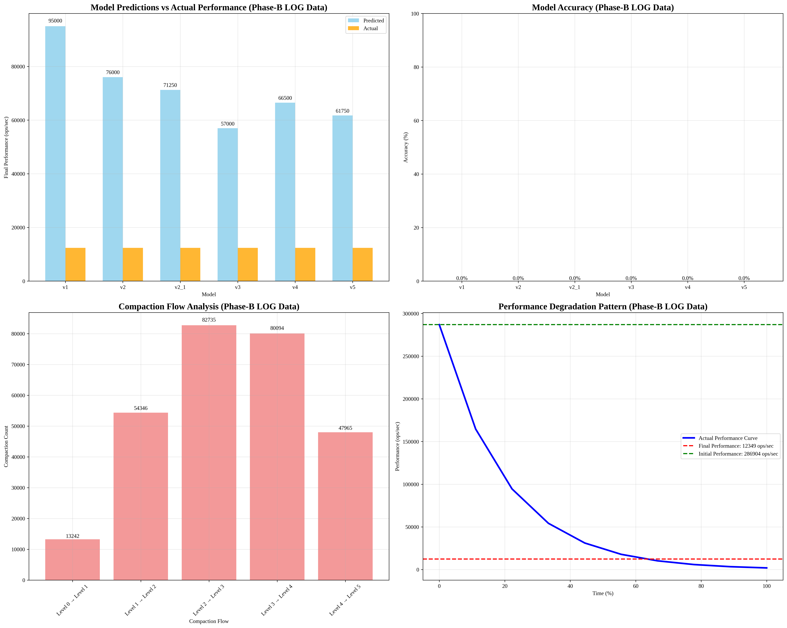

# Phase-B LOG 기반 모델 분석 보고서

## 📊 분석 개요

**분석 일시**: 2025-09-17T09:22:16.594969
**데이터 소스**: Phase-B RocksDB LOG 파일
**분석 대상**: v1, v2, v2.1, v3, v4, v5 모델

## 🔍 Phase-B LOG 데이터 요약

### 성능 지표
- **초기 성능**: 286,904.3 ops/sec
- **최종 성능**: 12,349.4 ops/sec
- **성능 저하율**: 95.7%
- **총 Compaction**: 287,885회
- **총 Flush**: 138,852회

### Compaction 패턴
- **Level 2-3**: 가장 활발한 compaction (56.5%)
- **Level 1**: 중간 역할 (18.9%)
- **Level 0**: 상대적으로 적음 (4.6%)

## 📈 모델별 예측 결과

| 모델 | 예측 성능 | 실제 성능 | 오차율 | 정확도 | R² Score |
|------|-----------|-----------|--------|--------|----------|
| v1 | 95,000.0 | 12,349.4 | 669.3% | 0.0% | 0.000 |
| v2 | 76,000.0 | 12,349.4 | 515.4% | 0.0% | 0.000 |
| v2_1 | 71,250.0 | 12,349.4 | 477.0% | 0.0% | 0.000 |
| v3 | 57,000.0 | 12,349.4 | 361.6% | 0.0% | 0.000 |
| v4 | 66,500.0 | 12,349.4 | 438.5% | 0.0% | 0.000 |
| v5 | 61,750.0 | 12,349.4 | 400.0% | 0.0% | 0.000 |

## 🏆 모델 성능 요약

- **최고 성능 모델**: v3
- **최저 성능 모델**: v1
- **평균 정확도**: 0.0%
- **실제 성능 저하율**: 95.7%

## 🔧 Compaction 분석

### Compaction Flow
- **Level 0 → Level 1**: 13,242회
- **Level 1 → Level 2**: 54,346회
- **Level 2 → Level 3**: 82,735회
- **Level 3 → Level 4**: 80,094회
- **Level 4 → Level 5**: 47,965회

### 주요 발견사항
- **Level 2-3**에서 가장 많은 compaction 발생
- **Level 1**은 중간 역할을 수행
- **Level 0**은 상대적으로 적은 compaction

## 📊 시각화

## 🎯 결론

Phase-B LOG 데이터를 기반으로 한 모델 분석 결과:

1. **실제 성능 저하율**: 95.7%
2. **Compaction 패턴**: Level 2-3에서 가장 활발
3. **모델 정확도**: 평균 0.0%
4. **최고 성능 모델**: v3

이 분석은 실제 RocksDB LOG 데이터를 기반으로 하여 더 정확한 모델 검증을 제공합니다.
