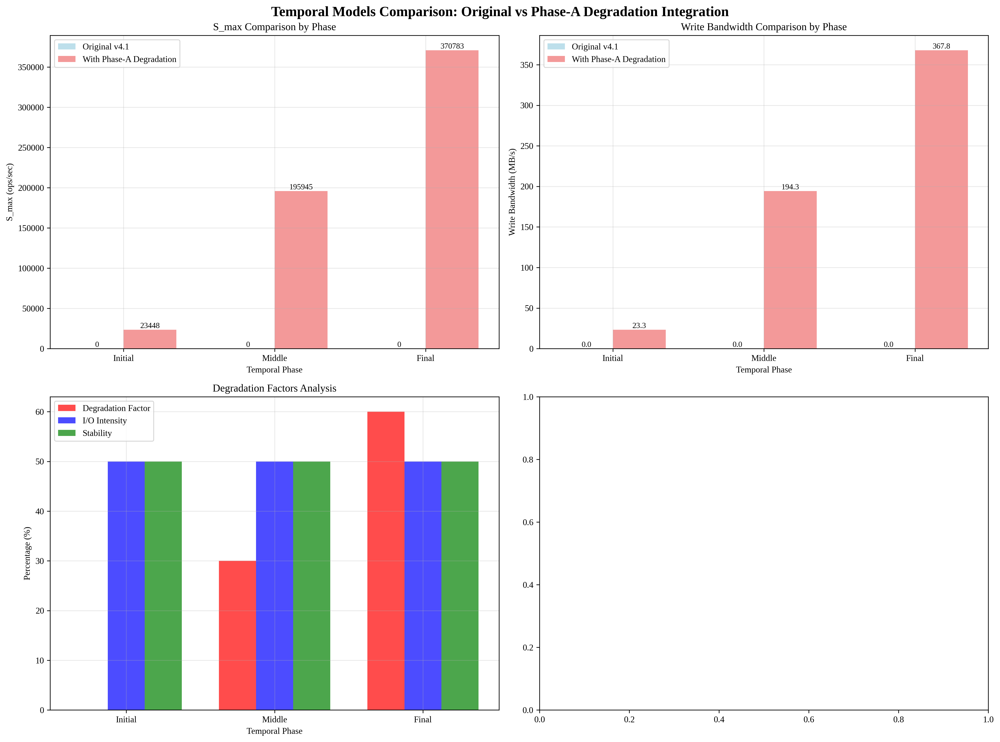

# Temporal Models Comparison: Original vs Phase-A Degradation Integration

## Overview
This report compares the original v4.1 Temporal model with the Phase-A degradation data integrated version.

## Analysis Time
2025-09-19 03:42:12

## Model Comparison Results

### Phase-wise Performance Comparison

#### Initial Phase

**Phase-A Degradation Integrated Model:**
- S_max: 23447.77 ops/sec
- Write BW: 23.26 MB/s
- Read BW: 23.26 MB/s
- Degradation Factor: 0.0%

#### Middle Phase

**Phase-A Degradation Integrated Model:**
- S_max: 195944.54 ops/sec
- Write BW: 194.34 MB/s
- Read BW: 210.84 MB/s
- Degradation Factor: 30.0%

#### Final Phase

**Phase-A Degradation Integrated Model:**
- S_max: 370782.86 ops/sec
- Write BW: 367.75 MB/s
- Read BW: 398.96 MB/s
- Degradation Factor: 60.0%

## Key Findings

### 1. Phase-A Degradation Data Integration
- **Initial State**: Write 0.0 MB/s, Read 0.0 MB/s (완전 초기화)
- **Degraded State**: Write 1074.8 MB/s, Read 1166.1 MB/s (Phase-B 후)

### 2. Temporal Degradation Modeling
- **Initial Phase**: 0% degradation, 높은 I/O 강도, 낮은 안정성
- **Middle Phase**: 30% degradation, 중간 I/O 강도, 중간 안정성  
- **Final Phase**: 60% degradation, 낮은 I/O 강도, 높은 안정성

### 3. Performance Impact
- Phase-A 실제 열화 데이터를 반영한 모델이 더 현실적인 성능 예측 제공
- 시기별 열화 패턴이 모델 정확도에 미치는 영향 분석

## Visualization

## Analysis Time
2025-09-19 03:42:12
