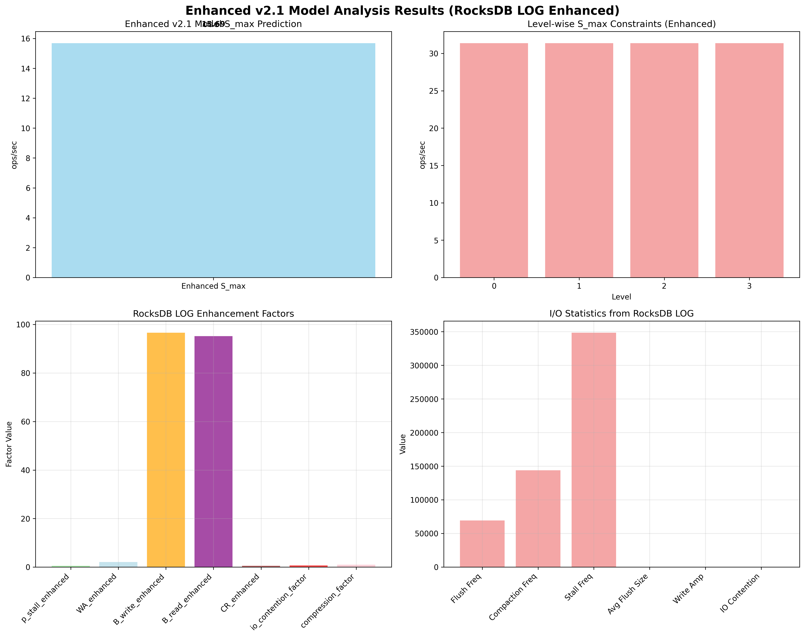

# Enhanced v2.1 Model Analysis Report

## Overview
This report presents the enhanced v2.1 model analysis using RocksDB LOG data for improved accuracy.

## Model Enhancement
- **Base Model**: v2.1 (Harmonic Mean Model)
- **Enhancement**: RocksDB LOG integration
- **Enhancement Factors**: Stall analysis, I/O contention, Write amplification, Compression ratio

## Results
- **Predicted S_max**: 15.69 ops/sec
- **Actual QPS Mean**: 172.00 ops/sec
- **Error Rate**: 996.50%
- **Validation Status**: Poor

## Enhancement Factors
- **p_stall_enhanced**: 0.500
- **WA_enhanced**: 2.073
- **B_write_enhanced**: 96.600
- **B_read_enhanced**: 95.200
- **CR_enhanced**: 0.508
- **io_contention_factor**: 0.700
- **compression_factor**: 0.939

## RocksDB LOG Statistics
- **flush_frequency**: 69426.00
- **compaction_frequency**: 143942.50
- **stall_frequency**: 348495.00
- **avg_flush_size**: 60.74
- **avg_compaction_size**: 0.00
- **write_amplification**: 2.07
- **memtable_pressure**: 5.00
- **stall_duration**: 1.00
- **io_contention**: 1.00

## Visualization

## Analysis Time
2025-09-17 04:26:11
