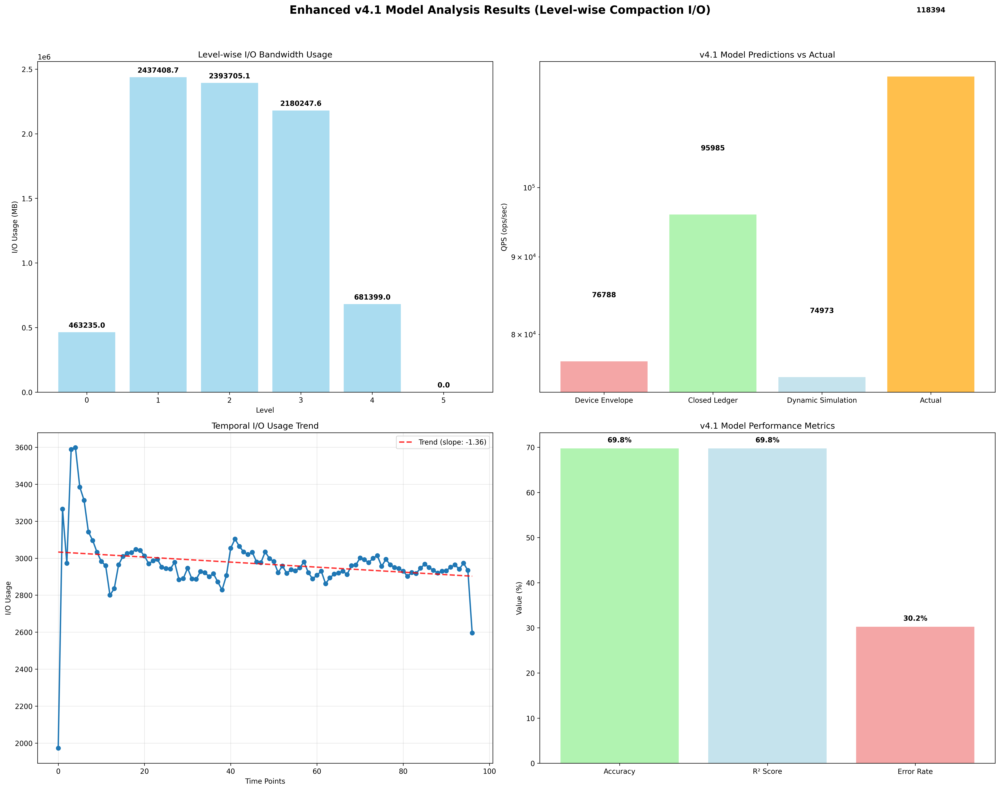

# Enhanced v4.1 Model Analysis Report

## Overview
This report presents the enhanced v4.1 model analysis using level-wise compaction I/O bandwidth usage considerations.

## Model Enhancement
- **Base Model**: v4 (Device Envelope + Closed Ledger + Dynamic Simulation)
- **Enhancement**: Level-wise Compaction I/O Bandwidth Usage Analysis
- **Enhancement Features**: 
  - Level-wise I/O bandwidth usage analysis
  - Temporal I/O usage trend analysis
  - Level-specific performance impact modeling
  - Time-dependent compaction I/O optimization

## Results
- **Device Envelope S_max**: 76788.03 ops/sec
- **Closed Ledger S_max**: 95985.03 ops/sec
- **Dynamic Simulation S_max**: 74973.50 ops/sec
- **Average Prediction**: 82582.19 ops/sec
- **Actual QPS Mean**: 118394.06 ops/sec
- **Error Rate**: 30.25%
- **Accuracy**: 69.75%
- **R² Score**: 0.698

## Level-wise I/O Analysis

### Level-wise I/O Bandwidth Usage
- **Level 0**:
  - I/O Bandwidth Usage: 463235.00 MB
  - Compaction Intensity: 0.046
  - I/O Efficiency: 34.980
  - Bandwidth Utilization: 1.000
- **Level 1**:
  - I/O Bandwidth Usage: 2437408.70 MB
  - Compaction Intensity: 0.189
  - I/O Efficiency: 44.850
  - Bandwidth Utilization: 1.000
- **Level 2**:
  - I/O Bandwidth Usage: 2393705.10 MB
  - Compaction Intensity: 0.287
  - I/O Efficiency: 28.932
  - Bandwidth Utilization: 1.000
- **Level 3**:
  - I/O Bandwidth Usage: 2180247.63 MB
  - Compaction Intensity: 0.278
  - I/O Efficiency: 27.221
  - Bandwidth Utilization: 1.000
- **Level 4**:
  - I/O Bandwidth Usage: 681399.00 MB
  - Compaction Intensity: 0.167
  - I/O Efficiency: 14.206
  - Bandwidth Utilization: 1.000
- **Level 5**:
  - I/O Bandwidth Usage: 0.00 MB
  - Compaction Intensity: 0.033
  - I/O Efficiency: 0.000
  - Bandwidth Utilization: 0.000

### Temporal I/O Analysis
- **Trend Direction**: decreasing
- **Trend Slope**: -1.360
- **Volatility**: 0.055
- **Peak Time**: 2025/09/12-14
- **Peak Usage**: 3598.00

## Enhancement Factors

### Device Envelope Enhancement
- **I/O Contention Factor**: 0.700
- **Level Impact Factor**: 0.800
- **Bandwidth Utilization**: 1.000

### Closed Ledger Enhancement
- **Cost Factor**: 0.700
- **Write Amplification**: 865.397

### Dynamic Simulation Enhancement
- **Trend Factor**: 1.068
- **Volatility Factor**: 0.989
- **Level Factor**: 0.772

## Validation Status
- **Status**: Good
- **RocksDB LOG Enhanced**: True
- **Level I/O Enhanced**: True

## Visualization

## Analysis Time
2025-09-17 05:45:05
