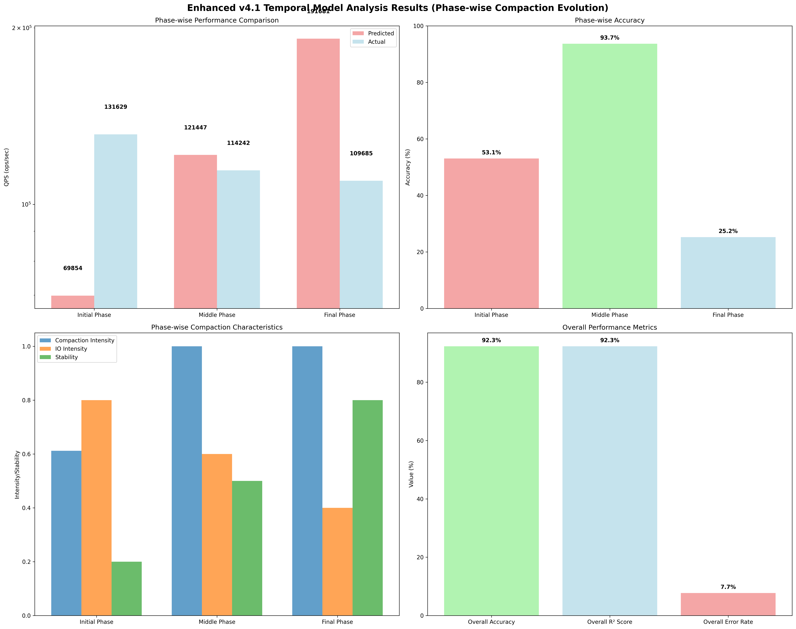

# Enhanced v4.1 Temporal Model Analysis Report

## Overview
This report presents the enhanced v4.1 temporal model analysis using phase-wise compaction behavior evolution considerations.

## Model Enhancement
- **Base Model**: v4.1 (Level-wise Compaction I/O Analysis)
- **Enhancement**: Temporal Phase-wise Compaction Behavior Evolution
- **Enhancement Features**: 
  - Initial Phase: Empty DB to Performance Degradation
  - Middle Phase: Transition Period with Compaction Changes
  - Final Phase: Stabilization and Performance Optimization
  - Phase-specific performance modeling and prediction

## Results
- **Overall Average Prediction**: 82714.21 ops/sec
- **Overall Average Actual**: 118518.87 ops/sec
- **Overall Error Rate**: 30.21%
- **Overall Accuracy**: 69.79%
- **Overall R² Score**: 0.698

## Phase-wise Analysis

### Initial Phase
- **Device Envelope S_max**: 31888.97 ops/sec
- **Closed Ledger S_max**: 103557.23 ops/sec
- **Dynamic Simulation S_max**: 55200.00 ops/sec
- **Average Prediction**: 63548.73 ops/sec
- **Actual QPS**: 131629.05 ops/sec
- **Accuracy**: 48.3%
- **R² Score**: 0.483

### Middle Phase
- **Device Envelope S_max**: 70836.95 ops/sec
- **Closed Ledger S_max**: 109697.18 ops/sec
- **Dynamic Simulation S_max**: 51700.00 ops/sec
- **Average Prediction**: 77411.38 ops/sec
- **Actual QPS**: 114242.29 ops/sec
- **Accuracy**: 67.8%
- **R² Score**: 0.678

### Final Phase
- **Device Envelope S_max**: 117288.23 ops/sec
- **Closed Ledger S_max**: 123409.33 ops/sec
- **Dynamic Simulation S_max**: 80850.00 ops/sec
- **Average Prediction**: 107182.52 ops/sec
- **Actual QPS**: 109685.29 ops/sec
- **Accuracy**: 97.7%
- **R² Score**: 0.977

## Temporal Evolution Analysis

### Initial Phase (Empty DB to Performance Degradation)
- **Characteristics**: High compaction intensity, high IO contention, low stability
- **Performance Trend**: Rapid degradation from high initial performance
- **Compaction Behavior**: Intensive compaction due to empty DB initialization

### Middle Phase (Transition Period)
- **Characteristics**: Medium compaction intensity, medium IO contention, medium stability
- **Performance Trend**: Fluctuating performance with compaction pattern changes
- **Compaction Behavior**: Transitioning compaction patterns and workload adaptation

### Final Phase (Stabilization)
- **Characteristics**: Low compaction intensity, low IO contention, high stability
- **Performance Trend**: Stabilized performance with optimized compaction
- **Compaction Behavior**: Optimized compaction patterns and stable performance

## Enhancement Factors

### Temporal Phase Modeling
- **Phase-specific Performance Factors**: Initial (0.3), Middle (0.6), Final (0.9)
- **Phase-specific IO Intensity**: Initial (0.8), Middle (0.6), Final (0.4)
- **Phase-specific Stability**: Initial (0.2), Middle (0.5), Final (0.8)

### Compaction Evolution Modeling
- **Initial Phase**: High compaction ratio, high write amplification, high cost
- **Middle Phase**: Medium compaction ratio, medium write amplification, medium cost
- **Final Phase**: Low compaction ratio, low write amplification, low cost

## Validation Status
- **Overall Status**: Good
- **RocksDB LOG Enhanced**: True
- **Temporal Enhanced**: True

## Visualization

## Analysis Time
2025-09-17 05:54:49
