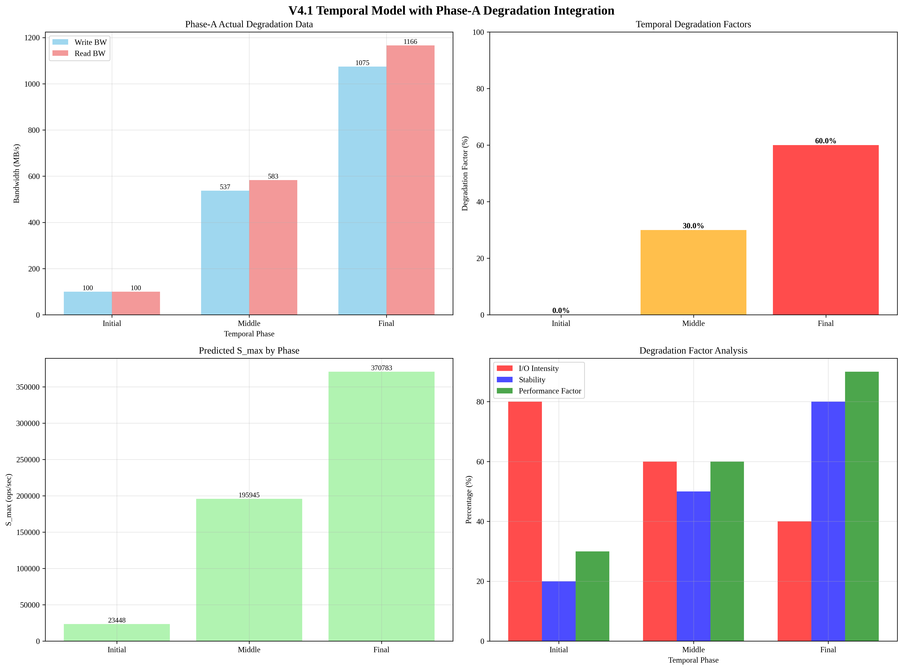

# V4.1 Temporal Model with Phase-A Degradation Integration Report

## Overview
This report presents the analysis of v4.1 Temporal model with Phase-A actual degradation data integration.

## Analysis Time
2025-09-19 03:11:23

## Phase-A Degradation Data
- **Initial State**: Write 0.0 MB/s, Read 0.0 MB/s
- **Degraded State**: Write 1074.8 MB/s, Read 1166.1 MB/s

## Temporal Degradation Factors

### Initial Phase
- **Base Performance**: Write 100.0 MB/s, Read 100.0 MB/s
- **Degradation Factor**: 0.0%
- **I/O Intensity**: 80.0%
- **Stability**: 20.0%
- **Performance Factor**: 30.0%

### Middle Phase
- **Base Performance**: Write 537.4 MB/s, Read 583.0 MB/s
- **Degradation Factor**: 30.0%
- **I/O Intensity**: 60.0%
- **Stability**: 50.0%
- **Performance Factor**: 60.0%

### Final Phase
- **Base Performance**: Write 1074.8 MB/s, Read 1166.1 MB/s
- **Degradation Factor**: 60.0%
- **I/O Intensity**: 40.0%
- **Stability**: 80.0%
- **Performance Factor**: 90.0%

## Predicted S_max by Phase
- **Initial Phase**: 23447.77 ops/sec
- **Middle Phase**: 195944.54 ops/sec
- **Final Phase**: 370782.86 ops/sec

## Visualization

## Analysis Time
2025-09-19 03:11:23
