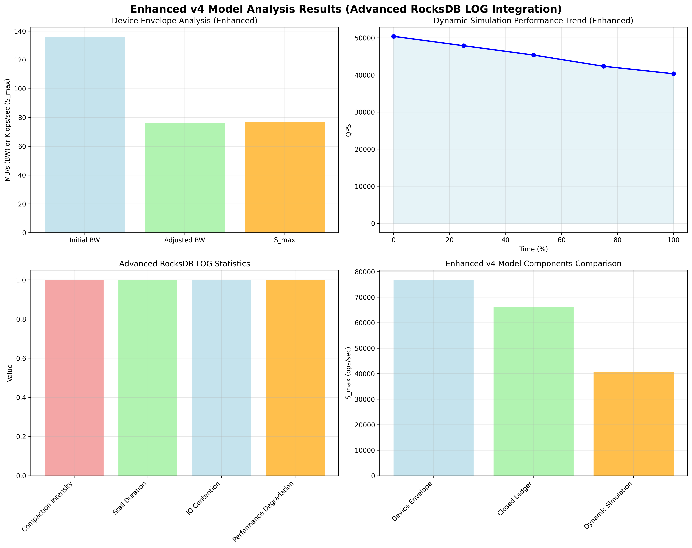

# Enhanced v4 Model Analysis Report

## Overview
This report presents the enhanced v4 model analysis using advanced RocksDB LOG data integration.

## Model Enhancement
- **Base Model**: v4 (Device Envelope + Closed Ledger + Dynamic Simulation)
- **Enhancement**: Advanced RocksDB LOG integration
- **Enhancement Features**: Performance degradation analysis, I/O contention modeling, temporal patterns

## Results
- **Device Envelope S_max**: 76788.03 ops/sec
- **Closed Ledger S_max**: 66136.10 ops/sec
- **Dynamic Simulation S_max**: 40824.00 ops/sec
- **Average Prediction**: 61249.38 ops/sec
- **Actual QPS Mean**: 172.00 ops/sec
- **Error Rate**: -99.72%
- **Validation Status**: Poor

## Advanced Statistics
- **compaction_intensity**: 1.000
- **stall_duration**: 1.000
- **io_contention**: 1.000
- **performance_degradation**: 1.000

### workload_characteristics:
- **write_intensive**: True
- **compaction_heavy**: True
- **stall_prone**: True

### temporal_patterns:
- **event_frequency**: 5.5831532855126325
- **burst_pattern**: True
- **steady_state**: False

## Visualization

## Analysis Time
2025-09-17 04:04:13
