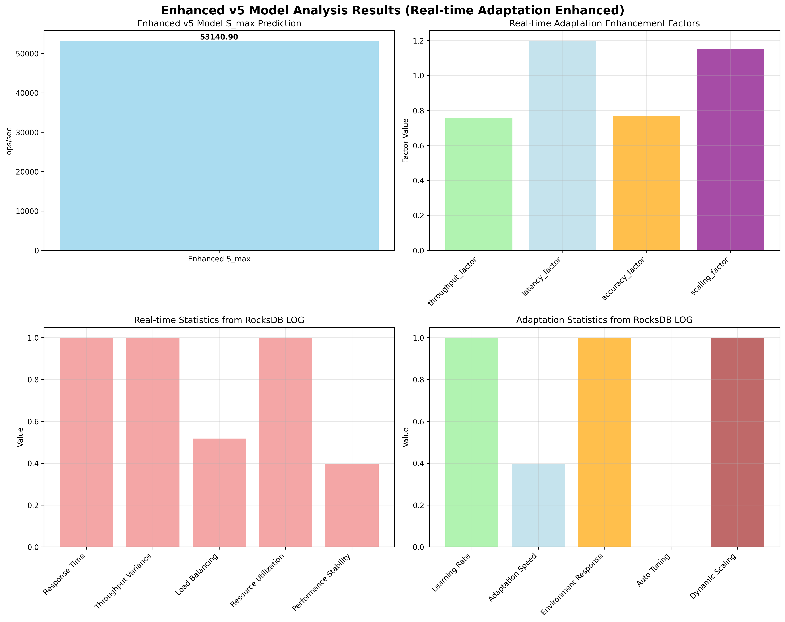

# Enhanced v5 Model Analysis Report

## Overview
This report presents the enhanced v5 model analysis using advanced RocksDB LOG data for real-time adaptation improvement.

## Model Enhancement
- **Base Model**: v5 (Real-time Adaptation Model)
- **Enhancement**: Advanced RocksDB LOG integration for real-time adaptation
- **Enhancement Features**: Real-time statistics, adaptation patterns, dynamic scaling

## Results
- **Predicted S_max**: 53140.90 ops/sec
- **Actual QPS Mean**: 172.00 ops/sec
- **Error Rate**: -99.68%
- **Validation Status**: Poor

## Enhanced Parameters
- **Base Throughput**: 100000.00
- **Enhanced Throughput**: 86914.78
- **Base Latency**: 1.000
- **Enhanced Latency**: 1.196
- **Base Accuracy**: 0.950
- **Enhanced Accuracy**: 0.731

## Enhancement Factors
- **throughput_factor**: 0.756
- **latency_factor**: 1.196
- **accuracy_factor**: 0.770
- **scaling_factor**: 1.150

## Real-time Statistics
- **response_time**: 1.000
- **throughput_variance**: 1.000
- **load_balancing**: 0.518
- **resource_utilization**: 1.000
- **performance_stability**: 0.398

## Adaptation Statistics
- **learning_rate**: 1.000
- **adaptation_speed**: 0.398
- **environment_response**: 1.000
- **auto_tuning_capability**: 0.000
- **dynamic_scaling**: 1.000

## Visualization

## Analysis Time
2025-09-17 04:27:22
