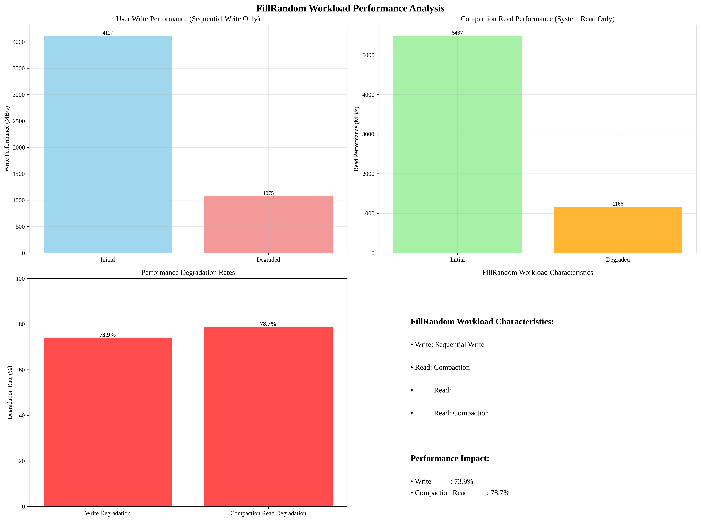

# FillRandom Workload Performance Analysis

## Overview
This report analyzes the performance characteristics of FillRandom workload using Phase-A data.

## Analysis Time
2025-09-19 04:41:48

## FillRandom Workload Characteristics
- **Write Type**: Sequential Write Only (사용자 Write)
- **Read Type**: Compaction Read Only (시스템 Read)
- **User Reads**: None
- **System Reads**: Compaction Only

## Phase-A Performance Data
- **Initial Seq Write**: 4116.6 MB/s
- **Initial Seq Read**: 5487.2 MB/s
- **Degraded Seq Write**: 1074.8 MB/s
- **Degraded Seq Read**: 1166.1 MB/s

## Key Findings: FillRandom Workload Performance

### 1. Write Performance (User Operations)
- **Initial Performance**: 4116.6 MB/s
- **Degraded Performance**: 1074.8 MB/s
- **Degradation Rate**: 73.9%

### 2. Compaction Read Performance (System Operations)
- **Initial Performance**: 5487.2 MB/s
- **Degraded Performance**: 1166.1 MB/s
- **Degradation Rate**: 78.7%

## Performance Analysis

### 1. Write Path Performance
- **Operation Type**: Sequential Write Only
- **Performance Impact**: 73.9% degradation
- **Implication**: 사용자 Write 성능이 크게 저하됨

### 2. Compaction Read Performance
- **Operation Type**: Compaction Read Only
- **Performance Impact**: 78.7% degradation
- **Implication**: Compaction 과정에서 Read 성능 저하

### 3. Overall Workload Impact
- **Write-Heavy Workload**: Sequential Write만 발생
- **No User Reads**: 사용자 Read 없음
- **System Reads Only**: Compaction에서만 Read 발생
- **Performance Bottleneck**: Write 성능 열화가 주요 병목

## Key Insights

### 1. FillRandom Workload 특성
- **Write Operations**: Sequential Write만 발생 (Random Write 없음)
- **Read Operations**: Compaction에서만 발생 (사용자 Read 없음)
- **Workload Pattern**: Write-Heavy, No User Reads

### 2. Performance Degradation Pattern
- **Write Performance**: 73.9% degradation
- **Compaction Read Performance**: 78.7% degradation
- **Overall Impact**: Write 성능 열화가 전체 성능에 미치는 영향이 큼

### 3. Implications for RocksDB Modeling
- **Write Path**: Sequential Write 성능이 전체 성능에 미치는 영향
- **Compaction Path**: Compaction Read 성능이 Compaction 효율성에 미치는 영향
- **Model Accuracy**: FillRandom 워크로드 특성을 정확히 반영한 모델링 필요

## Visualization

## Analysis Time
2025-09-19 04:41:48
