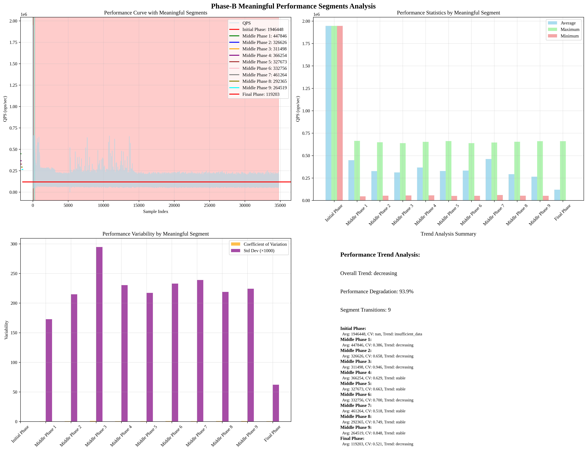

# Phase-B Meaningful Performance Segments Analysis

## Overview
This report presents the analysis of meaningful performance segments in Phase-B data, identifying natural performance phases based on significant performance changes.

## Analysis Time
2025-09-19 10:47:15

## Meaningful Performance Segments Analysis Results

### Meaningful Performance Segments
- **Total Segments**: 11
- **Segmentation Method**: Significant change-based analysis

#### Initial Phase Phase
- **Start Index**: 0
- **End Index**: 1
- **Sample Count**: 1
- **Segmentation Type**: change_based

#### Middle Phase 1 Phase
- **Start Index**: 1
- **End Index**: 45
- **Sample Count**: 44
- **Segmentation Type**: change_based

#### Middle Phase 2 Phase
- **Start Index**: 45
- **End Index**: 64
- **Sample Count**: 19
- **Segmentation Type**: change_based

#### Middle Phase 3 Phase
- **Start Index**: 64
- **End Index**: 68
- **Sample Count**: 4
- **Segmentation Type**: change_based

#### Middle Phase 4 Phase
- **Start Index**: 68
- **End Index**: 81
- **Sample Count**: 13
- **Segmentation Type**: change_based

#### Middle Phase 5 Phase
- **Start Index**: 81
- **End Index**: 126
- **Sample Count**: 45
- **Segmentation Type**: change_based

#### Middle Phase 6 Phase
- **Start Index**: 126
- **End Index**: 137
- **Sample Count**: 11
- **Segmentation Type**: change_based

#### Middle Phase 7 Phase
- **Start Index**: 137
- **End Index**: 142
- **Sample Count**: 5
- **Segmentation Type**: change_based

#### Middle Phase 8 Phase
- **Start Index**: 142
- **End Index**: 212
- **Sample Count**: 70
- **Segmentation Type**: change_based

#### Middle Phase 9 Phase
- **Start Index**: 212
- **End Index**: 293
- **Sample Count**: 81
- **Segmentation Type**: change_based

#### Final Phase Phase
- **Start Index**: 293
- **End Index**: 34,778
- **Sample Count**: 34,485
- **Segmentation Type**: change_based

### Segment Characteristics

#### Initial Phase Phase Characteristics
- **Sample Count**: 1
- **Average QPS**: 1946448.00 ops/sec
- **Maximum QPS**: 1946448.00 ops/sec
- **Minimum QPS**: 1946448.00 ops/sec
- **Standard Deviation**: nan ops/sec
- **Coefficient of Variation**: nan
- **Trend**: insufficient_data

#### Middle Phase 1 Phase Characteristics
- **Sample Count**: 44
- **Average QPS**: 447846.23 ops/sec
- **Maximum QPS**: 663287.00 ops/sec
- **Minimum QPS**: 45724.00 ops/sec
- **Standard Deviation**: 172691.82 ops/sec
- **Coefficient of Variation**: 0.386
- **Trend**: decreasing

#### Middle Phase 2 Phase Characteristics
- **Sample Count**: 19
- **Average QPS**: 326625.63 ops/sec
- **Maximum QPS**: 647664.00 ops/sec
- **Minimum QPS**: 52106.00 ops/sec
- **Standard Deviation**: 214824.09 ops/sec
- **Coefficient of Variation**: 0.658
- **Trend**: decreasing

#### Middle Phase 3 Phase Characteristics
- **Sample Count**: 4
- **Average QPS**: 311498.25 ops/sec
- **Maximum QPS**: 638486.00 ops/sec
- **Minimum QPS**: 54931.00 ops/sec
- **Standard Deviation**: 294693.30 ops/sec
- **Coefficient of Variation**: 0.946
- **Trend**: decreasing

#### Middle Phase 4 Phase Characteristics
- **Sample Count**: 13
- **Average QPS**: 366254.00 ops/sec
- **Maximum QPS**: 653400.00 ops/sec
- **Minimum QPS**: 55657.00 ops/sec
- **Standard Deviation**: 230310.63 ops/sec
- **Coefficient of Variation**: 0.629
- **Trend**: stable

#### Middle Phase 5 Phase Characteristics
- **Sample Count**: 45
- **Average QPS**: 327672.71 ops/sec
- **Maximum QPS**: 660843.00 ops/sec
- **Minimum QPS**: 50584.00 ops/sec
- **Standard Deviation**: 217261.36 ops/sec
- **Coefficient of Variation**: 0.663
- **Trend**: stable

#### Middle Phase 6 Phase Characteristics
- **Sample Count**: 11
- **Average QPS**: 332756.00 ops/sec
- **Maximum QPS**: 638751.00 ops/sec
- **Minimum QPS**: 51147.00 ops/sec
- **Standard Deviation**: 232899.99 ops/sec
- **Coefficient of Variation**: 0.700
- **Trend**: decreasing

#### Middle Phase 7 Phase Characteristics
- **Sample Count**: 5
- **Average QPS**: 461263.60 ops/sec
- **Maximum QPS**: 646084.00 ops/sec
- **Minimum QPS**: 60183.00 ops/sec
- **Standard Deviation**: 238976.62 ops/sec
- **Coefficient of Variation**: 0.518
- **Trend**: stable

#### Middle Phase 8 Phase Characteristics
- **Sample Count**: 70
- **Average QPS**: 292364.51 ops/sec
- **Maximum QPS**: 653583.00 ops/sec
- **Minimum QPS**: 52567.00 ops/sec
- **Standard Deviation**: 218855.31 ops/sec
- **Coefficient of Variation**: 0.749
- **Trend**: stable

#### Middle Phase 9 Phase Characteristics
- **Sample Count**: 81
- **Average QPS**: 264518.79 ops/sec
- **Maximum QPS**: 660221.00 ops/sec
- **Minimum QPS**: 51119.00 ops/sec
- **Standard Deviation**: 224250.82 ops/sec
- **Coefficient of Variation**: 0.848
- **Trend**: stable

#### Final Phase Phase Characteristics
- **Sample Count**: 34,485
- **Average QPS**: 119202.79 ops/sec
- **Maximum QPS**: 660317.00 ops/sec
- **Minimum QPS**: 160.00 ops/sec
- **Standard Deviation**: 62089.11 ops/sec
- **Coefficient of Variation**: 0.521
- **Trend**: decreasing

### Performance Trends Analysis
- **Overall Trend**: decreasing
- **Segment Transitions**: 9

- **Performance Degradation**: 93.9%
- **First Phase Average**: 1946448.00 ops/sec
- **Last Phase Average**: 119202.79 ops/sec

## Key Insights

### 1. Meaningful Performance Segments
- **Significant Change-based Segmentation**: Segments identified based on significant performance changes
- **Performance Variability**: Different segments show different variability patterns
- **Trend Analysis**: Each segment has distinct performance trends

### 2. Performance Characteristics
- **Segment-specific Patterns**: Each segment has unique performance characteristics
- **Variability Analysis**: Coefficient of variation shows stability differences
- **Trend Identification**: Linear regression analysis reveals performance trends

### 3. Model Improvement Implications
- **Accurate Segment Definition**: Natural performance segments for better model training
- **Segment-specific Modeling**: Different models for different performance segments
- **Trend-based Predictions**: Trend analysis for better performance prediction

## Visualization

## Analysis Time
2025-09-19 10:47:15
