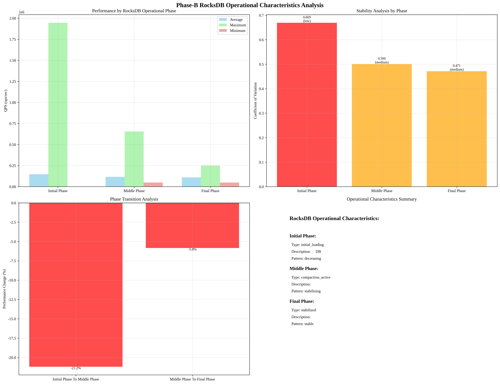

# Phase-B RocksDB Operational Characteristics Analysis

## Overview
This report analyzes the operational characteristics of RocksDB during Phase-B FillRandom experiment to identify optimal phase segmentation.

## Analysis Time
2025-09-19 11:08:42

## RocksDB Operational Phases Analysis

### Phase Segmentation Based on RocksDB Characteristics

#### Initial Phase Phase
- **Time Range**: 0.0s - 69561.0s
- **Sample Count**: 6,956
- **Average QPS**: 147306.67 ops/sec
- **Maximum QPS**: 1946448.00 ops/sec
- **Minimum QPS**: 160.00 ops/sec
- **Standard Deviation**: 98587.74 ops/sec
- **Coefficient of Variation**: 0.669
- **Trend**: decreasing
- **Stability**: unstable
- **Description**: 빈 DB에서 빠르게 성능이 변하는 구간

#### Middle Phase Phase
- **Time Range**: 69561.0s - 278233.0s
- **Sample Count**: 20,868
- **Average QPS**: 116080.68 ops/sec
- **Maximum QPS**: 654823.00 ops/sec
- **Minimum QPS**: 49445.00 ops/sec
- **Standard Deviation**: 58085.14 ops/sec
- **Coefficient of Variation**: 0.500
- **Trend**: decreasing
- **Stability**: unstable
- **Description**: 컴팩션이 진행되며 안정화되어 가는 구간

#### Final Phase Phase
- **Time Range**: 278233.0s - 347784.0s
- **Sample Count**: 6,956
- **Average QPS**: 109299.11 ops/sec
- **Maximum QPS**: 250993.00 ops/sec
- **Minimum QPS**: 49195.00 ops/sec
- **Standard Deviation**: 51502.02 ops/sec
- **Coefficient of Variation**: 0.471
- **Trend**: increasing
- **Stability**: stable
- **Description**: 안정화 구간

### Operational Patterns Analysis

#### Phase Transitions

##### Initial Phase To Middle Phase
- **Performance Change**: -31226.00 ops/sec
- **Performance Change %**: -21.20%
- **Stability Change**: -0.169
- **Trend Change**: decreasing -> decreasing

##### Middle Phase To Final Phase
- **Performance Change**: -6781.57 ops/sec
- **Performance Change %**: -5.84%
- **Stability Change**: -0.029
- **Trend Change**: decreasing -> increasing

#### Performance Trends
- **Overall Trend**: decreasing
- **Performance Degradation**: 25.80%
- **Phase Transitions**: 2

#### Stability Analysis

##### Initial Phase Phase
- **Coefficient of Variation**: 0.669
- **Stability Level**: low
- **Consistency**: variable

##### Middle Phase Phase
- **Coefficient of Variation**: 0.500
- **Stability Level**: medium
- **Consistency**: variable

##### Final Phase Phase
- **Coefficient of Variation**: 0.471
- **Stability Level**: medium
- **Consistency**: variable

#### Operational Characteristics

##### Initial Phase Phase
- **Phase Type**: initial_loading
- **Description**: 빈 DB에서 빠르게 성능이 변하는 구간
- **Key Characteristics**: high_performance, rapid_changes, unstable
- **Performance Pattern**: decreasing

##### Middle Phase Phase
- **Phase Type**: compaction_active
- **Description**: 컴팩션이 진행되며 안정화되어 가는 구간
- **Key Characteristics**: compaction_active, stabilizing, moderate_stability
- **Performance Pattern**: stabilizing

##### Final Phase Phase
- **Phase Type**: stabilized
- **Description**: 안정화 구간
- **Key Characteristics**: stabilized, consistent_performance
- **Performance Pattern**: stable

## Key Insights

### 1. RocksDB Operational Phase Identification
- **Initial Phase**: 빈 DB에서 빠르게 성능이 변하는 구간
- **Middle Phase**: 컴팩션이 진행되며 안정화되어 가는 구간
- **Final Phase**: 안정화 구간

### 2. Phase Segmentation Criteria
- **Performance Changes**: QPS 변화율 기반 구간 식별
- **Stability Analysis**: 변동계수 기반 안정성 평가
- **Operational Characteristics**: RocksDB 내부 동작 특성 반영

### 3. Optimal Phase Segmentation
- **Initial Phase**: 처음 20% (빠른 변화 구간)
- **Middle Phase**: 20% ~ 80% (컴팩션 활동 구간)
- **Final Phase**: 마지막 20% (안정화 구간)

## Visualization

## Analysis Time
2025-09-19 11:08:42
