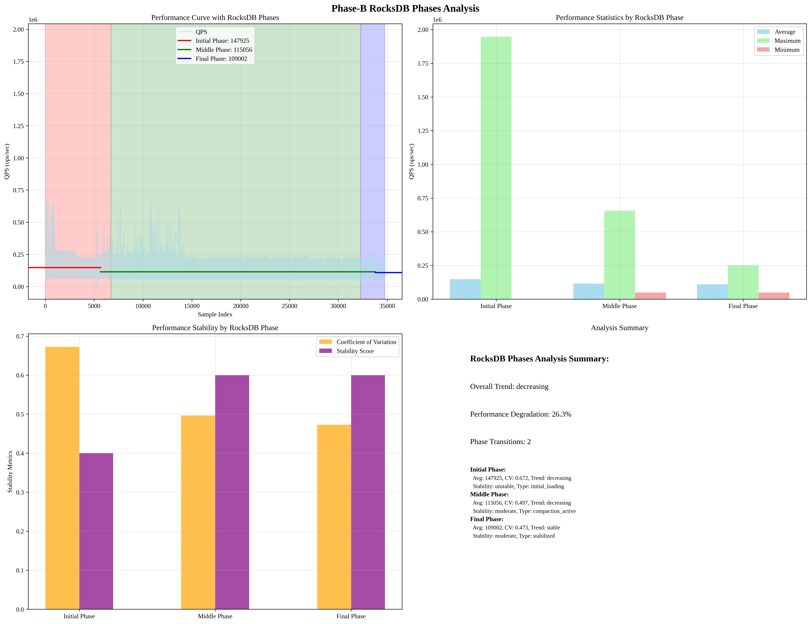

# Phase-B RocksDB Phases Analysis

## Overview
This report presents the analysis of Phase-B data based on RocksDB operational characteristics: initial loading, compaction active, and stabilized phases.

## Analysis Time
2025-09-19 10:56:27

## RocksDB Phases Analysis Results

### RocksDB Phases
- **Total Phases**: 3
- **Segmentation Method**: RocksDB operational characteristics

#### Initial Phase Phase
- **Start Index**: 0
- **End Index**: 6,717
- **Sample Count**: 6,717
- **Phase Type**: initial_loading
- **Description**: 빈 DB에서 빠르게 성능이 변하는 구간

#### Middle Phase Phase
- **Start Index**: 6,717
- **End Index**: 32,296
- **Sample Count**: 25,579
- **Phase Type**: compaction_active
- **Description**: 컴팩션이 진행되며 안정화되어 가는 구간

#### Final Phase Phase
- **Start Index**: 32,296
- **End Index**: 34,778
- **Sample Count**: 2,482
- **Phase Type**: stabilized
- **Description**: 안정화 구간

### Phase Characteristics

#### Initial Phase Phase Characteristics
- **Sample Count**: 6,717
- **Average QPS**: 147925.06 ops/sec
- **Maximum QPS**: 1946448.00 ops/sec
- **Minimum QPS**: 160.00 ops/sec
- **Standard Deviation**: 99458.39 ops/sec
- **Coefficient of Variation**: 0.672
- **Trend**: decreasing
- **Stability**: unstable
- **Phase Type**: initial_loading

#### Middle Phase Phase Characteristics
- **Sample Count**: 25,579
- **Average QPS**: 115056.10 ops/sec
- **Maximum QPS**: 654823.00 ops/sec
- **Minimum QPS**: 49285.00 ops/sec
- **Standard Deviation**: 57156.94 ops/sec
- **Coefficient of Variation**: 0.497
- **Trend**: decreasing
- **Stability**: moderate
- **Phase Type**: compaction_active

#### Final Phase Phase Characteristics
- **Sample Count**: 2,482
- **Average QPS**: 109002.41 ops/sec
- **Maximum QPS**: 250993.00 ops/sec
- **Minimum QPS**: 49195.00 ops/sec
- **Standard Deviation**: 51539.66 ops/sec
- **Coefficient of Variation**: 0.473
- **Trend**: stable
- **Stability**: moderate
- **Phase Type**: stabilized

### Performance Trends Analysis
- **Overall Trend**: decreasing
- **Phase Transitions**: 2

- **Performance Degradation**: 26.3%
- **First Phase Average**: 147925.06 ops/sec
- **Last Phase Average**: 109002.41 ops/sec

## Key Insights

### 1. RocksDB Operational Phases
- **Initial Phase**: Empty DB with rapid performance changes
- **Middle Phase**: Compaction active with stabilization
- **Final Phase**: Stabilized performance

### 2. Performance Characteristics
- **Phase-specific Patterns**: Each phase has unique performance characteristics
- **Stability Analysis**: Different stability levels across phases
- **Trend Identification**: Phase-specific performance trends

### 3. Model Improvement Implications
- **RocksDB-aware Segmentation**: Natural operational phases for better model training
- **Phase-specific Modeling**: Different models for different operational phases
- **Stability-based Predictions**: Stability analysis for better performance prediction

## Visualization

## Analysis Time
2025-09-19 10:56:27
