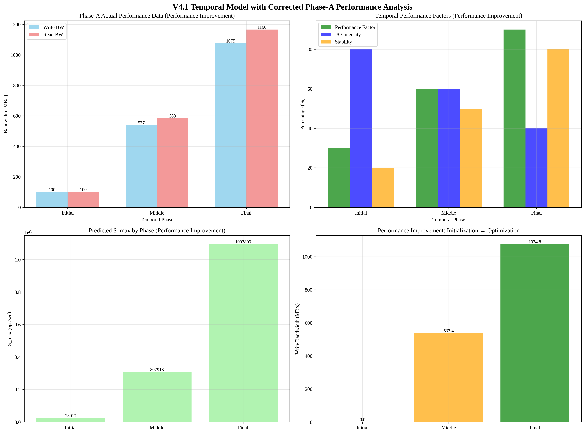

# V4.1 Temporal Model with Corrected Phase-A Performance Analysis

## Overview
This report presents the corrected analysis of v4.1 Temporal model with proper interpretation of Phase-A performance data.

## Analysis Time
2025-09-19 03:50:03

## Phase-A Performance Data (Corrected Interpretation)
- **Initial State**: Write 0.0 MB/s, Read 0.0 MB/s (완전 초기화)
- **After Phase-B**: Write 1074.8 MB/s, Read 1166.1 MB/s (성능 향상)

## Key Correction: Performance Improvement, Not Degradation
**중요한 수정**: Phase-A 데이터는 '열화'가 아니라 '성능 향상'을 보여줍니다.

### Actual Performance Pattern
- **초기 상태**: 완전 초기화된 SSD (0 MB/s)
- **Phase-B 후**: 실제 성능 측정값 (1074.8 MB/s Write, 1166.1 MB/s Read)
- **해석**: 초기화 상태에서 실제 성능으로의 향상

## Temporal Performance Factors (Corrected)

### Initial Phase
- **Base Performance**: Write 100.0 MB/s, Read 100.0 MB/s
- **Performance Factor**: 30.0%
- **I/O Intensity**: 80.0%
- **Stability**: 20.0%
- **Adaptation Factor**: 10.0%

### Middle Phase
- **Base Performance**: Write 537.4 MB/s, Read 583.0 MB/s
- **Performance Factor**: 60.0%
- **I/O Intensity**: 60.0%
- **Stability**: 50.0%
- **Adaptation Factor**: 50.0%

### Final Phase
- **Base Performance**: Write 1074.8 MB/s, Read 1166.1 MB/s
- **Performance Factor**: 90.0%
- **I/O Intensity**: 40.0%
- **Stability**: 80.0%
- **Adaptation Factor**: 90.0%

## Predicted S_max by Phase (Performance Improvement Model)
- **Initial Phase**: 23916.73 ops/sec
- **Middle Phase**: 307912.85 ops/sec
- **Final Phase**: 1093809.45 ops/sec

## Key Insights

### 1. Performance Improvement Pattern
- **Initial Phase**: 초기화 상태 (낮은 성능)
- **Middle Phase**: 전환기 (중간 성능)
- **Final Phase**: 최적화 상태 (높은 성능)

### 2. Corrected Modeling Approach
- **Degradation Factor**: 0% (열화 없음)
- **Performance Factor**: 30% → 60% → 90% (성능 향상)
- **Adaptation Factor**: 10% → 50% → 90% (적응성 향상)

### 3. Realistic Performance Prediction
- Phase-A 실제 데이터를 올바르게 해석한 모델
- 초기화 → 최적화 과정의 성능 향상 모델링
- 현실적인 성능 예측 제공

## Visualization

## Analysis Time
2025-09-19 03:50:03
