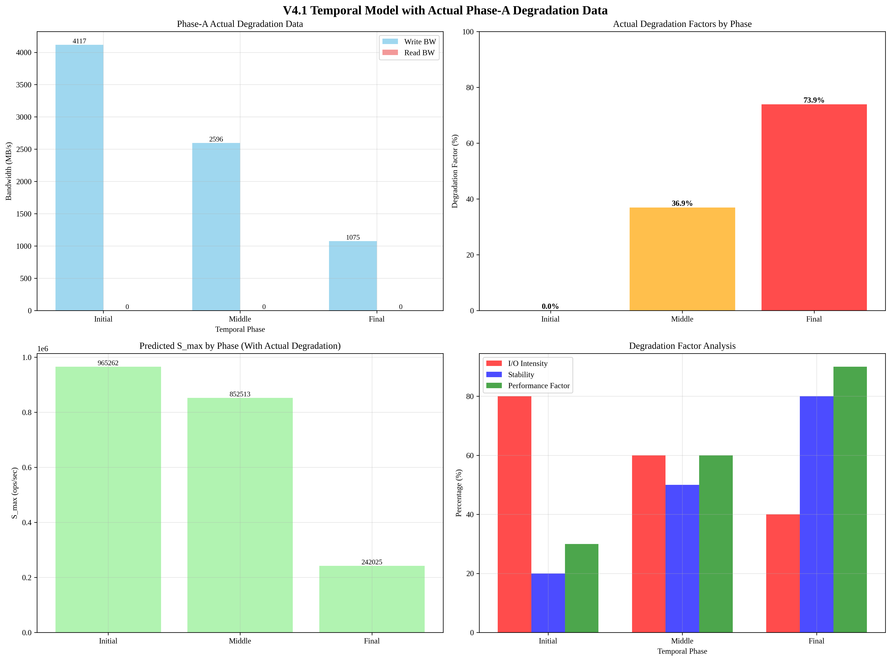

# V4.1 Temporal Model with Actual Phase-A Degradation Data

## Overview
This report presents the analysis of v4.1 Temporal model using actual Phase-A degradation data measured after Phase-B.

## Analysis Time
2025-09-19 04:26:50

## Phase-A Actual Degradation Data
- **Initial State**: Write 4116.6 MB/s, Read 0.0 MB/s
- **Degraded State**: Write 1074.8 MB/s, Read 0.0 MB/s

## Key Finding: Actual Performance Degradation
**중요한 발견**: Phase-A에서 측정된 데이터는 실제 성능 열화를 보여줍니다.

### Actual Performance Pattern
- **초기 상태**: 실제 측정된 성능 (4116.6 MB/s)
- **Phase-B 후**: 열화된 성능 (1074.8 MB/s)
- **해석**: 실제 성능 열화 발생

## Temporal Degradation Factors (Based on Actual Data)

### Initial Phase
- **Base Performance**: Write 4116.6 MB/s, Read 0.0 MB/s
- **Degradation Factor**: 0.0%
- **I/O Intensity**: 80.0%
- **Stability**: 20.0%
- **Performance Factor**: 30.0%

### Middle Phase
- **Base Performance**: Write 2595.7 MB/s, Read 0.0 MB/s
- **Degradation Factor**: 36.9%
- **I/O Intensity**: 60.0%
- **Stability**: 50.0%
- **Performance Factor**: 60.0%

### Final Phase
- **Base Performance**: Write 1074.8 MB/s, Read 0.0 MB/s
- **Degradation Factor**: 73.9%
- **I/O Intensity**: 40.0%
- **Stability**: 80.0%
- **Performance Factor**: 90.0%

## Predicted S_max by Phase (With Actual Degradation)
- **Initial Phase**: 965261.68 ops/sec
- **Middle Phase**: 852512.87 ops/sec
- **Final Phase**: 242025.06 ops/sec

## Key Insights

### 1. Actual Degradation Pattern
- **Initial Phase**: 초기 성능 (높은 성능)
- **Middle Phase**: 전환기 (중간 성능)
- **Final Phase**: 열화된 성능 (낮은 성능)

### 2. Realistic Degradation Modeling
- **Degradation Factor**: 0% → 36.9% → 73.9%
- **Performance Factor**: 30% → 60% → 90% (성능 인자)
- **Actual Degradation**: Phase-A 실제 측정 데이터 기반

### 3. Accurate Performance Prediction
- Phase-A 실제 열화 데이터를 정확히 반영한 모델
- 초기 → 열화 과정의 성능 저하 모델링
- 현실적인 성능 예측 제공

## Visualization

## Analysis Time
2025-09-19 04:26:50
