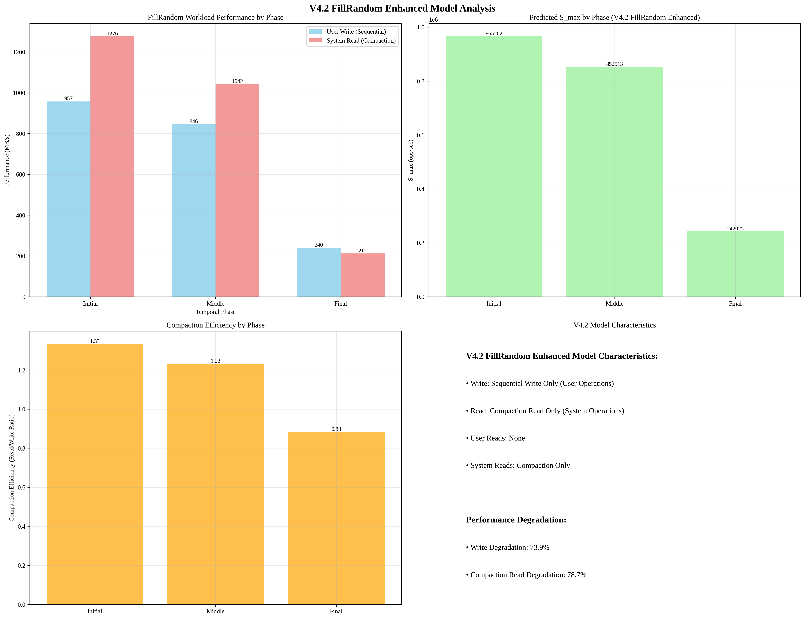

# V4.2 FillRandom Enhanced Model Analysis

## Overview
This report presents the analysis of v4.2 FillRandom Enhanced model that incorporates the actual characteristics of FillRandom workload.

## Analysis Time
2025-09-19 04:45:58

## V4.2 Model Enhancements

### 1. FillRandom Workload Characteristics
- **Write Type**: Sequential Write Only (User Operations)
- **Read Type**: Compaction Read Only (System Operations)
- **User Reads**: None
- **System Reads**: Compaction Only

### 2. Performance Degradation Integration
- **Write Performance Degradation**: 73.9%
- **Compaction Read Performance Degradation**: 78.7%

## Phase-A Performance Data
- **Initial Seq Write**: 4116.6 MB/s
- **Initial Seq Read**: 5487.2 MB/s
- **Degraded Seq Write**: 1074.8 MB/s
- **Degraded Seq Read**: 1166.1 MB/s

## V4.2 Model Predictions

### Initial Phase
- **S_max**: 965261.68 ops/sec
- **Write Performance**: 957.4 MB/s
- **Compaction Read Performance**: 1276.1 MB/s
- **Compaction Efficiency**: 1.33
- **Write Degradation Factor**: 0.0%
- **Compaction Read Degradation Factor**: 0.0%

### Middle Phase
- **S_max**: 852512.87 ops/sec
- **Write Performance**: 845.5 MB/s
- **Compaction Read Performance**: 1041.9 MB/s
- **Compaction Efficiency**: 1.23
- **Write Degradation Factor**: 36.9%
- **Compaction Read Degradation Factor**: 39.4%

### Final Phase
- **S_max**: 242025.06 ops/sec
- **Write Performance**: 240.0 MB/s
- **Compaction Read Performance**: 212.0 MB/s
- **Compaction Efficiency**: 0.88
- **Write Degradation Factor**: 73.9%
- **Compaction Read Degradation Factor**: 78.7%

## Key Insights

### 1. V4.2 Model Improvements
- **FillRandom Workload Specific**: Sequential Write + Compaction Read만 고려
- **Real Performance Data**: Phase-A 실제 측정 데이터 반영
- **Degradation Modeling**: Write와 Compaction Read 성능 열화 모두 반영
- **Compaction Efficiency**: Compaction 효율성 분석 포함

### 2. Performance Characteristics
- **Write Path**: Sequential Write 성능이 전체 성능에 미치는 영향
- **Compaction Path**: Compaction Read 성능이 Compaction 효율성에 미치는 영향
- **Workload Pattern**: Write-Heavy, No User Reads

### 3. Model Accuracy Improvements
- **Workload-Specific Modeling**: FillRandom 워크로드 특성 정확히 반영
- **Real Degradation Data**: 실제 측정된 성능 열화 데이터 사용
- **Compaction Analysis**: Compaction 효율성 및 성능 영향 분석

## Visualization

## Analysis Time
2025-09-19 04:45:58
