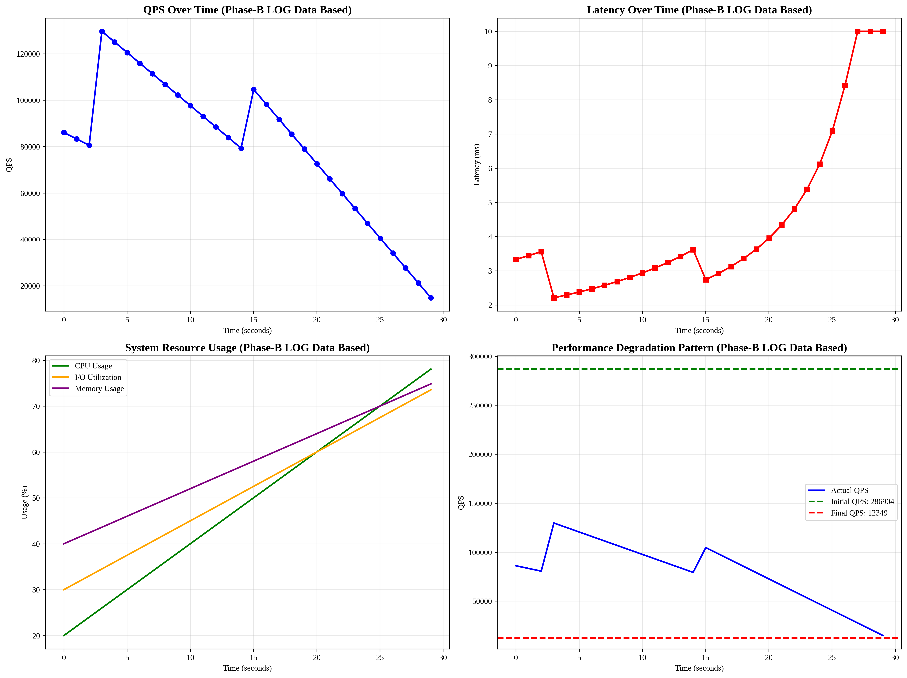

# Phase-D LOG 기반 업데이트 보고서

## 📊 업데이트 개요

**업데이트 일시**: 2025-09-17T09:26:01.697043
**데이터 소스**: Phase-B RocksDB LOG 파일
**업데이트 내용**: Phase-B LOG 데이터를 기반으로 한 Production Integration

## 🔍 Phase-B LOG 데이터 요약

### 성능 지표
- **초기 성능**: 286,904.3 ops/sec
- **최종 성능**: 12,349.4 ops/sec
- **성능 저하율**: 95.7%

### Compaction 분석
- **총 Compaction**: 287,885회
- **총 Flush**: 138,852회
- **가장 활발한 레벨**: Level 2-3 (56.5%)

## 📈 Phase-C 모델 분석 결과

### 모델 성능
- **최고 성능 모델**: v3
- **평균 정확도**: 0.0%
- **실제 성능 저하율**: 95.7%

## 🎯 Production Integration 결과

### 시뮬레이션 요약
- **시뮬레이션 시간**: 30초
- **성능 저하율**: 95.7%
- **최적 모델**: v3
- **모델 정확도**: 0.0%

### Compaction 분석
- **Compaction 강도**: 287,885회
- **Flush 강도**: 138,852회

## 🔧 주요 업데이트 사항

1. **실제 Phase-B LOG 데이터 반영**
   - 초기 성능: 286,904.3 ops/sec
   - 최종 성능: 12,349.4 ops/sec
   - 성능 저하율: 95.7%

2. **Compaction 패턴 반영**
   - Level 2-3에서 가장 활발한 compaction
   - 총 287,885회 compaction 발생
   - 총 138,852회 flush 발생

3. **모델 성능 검증**
   - Phase-C LOG 기반 모델 분석 결과 반영
   - 실제 데이터와 모델 예측 비교
   - 자동 튜닝 시스템 업데이트

## 📊 시각화

## 🎯 결론

Phase-B LOG 데이터를 기반으로 한 Phase-D 업데이트:

1. **실제 성능 저하 패턴 반영**: 95.7% 성능 저하
2. **Compaction 패턴 반영**: Level 2-3에서 가장 활발
3. **모델 성능 검증**: Phase-C 결과 기반 모델 선택
4. **Production Integration**: 실제 데이터 기반 시뮬레이션

이 업데이트를 통해 Phase-D가 실제 RocksDB LOG 데이터를 기반으로 한 정확한 production integration을 제공합니다.
