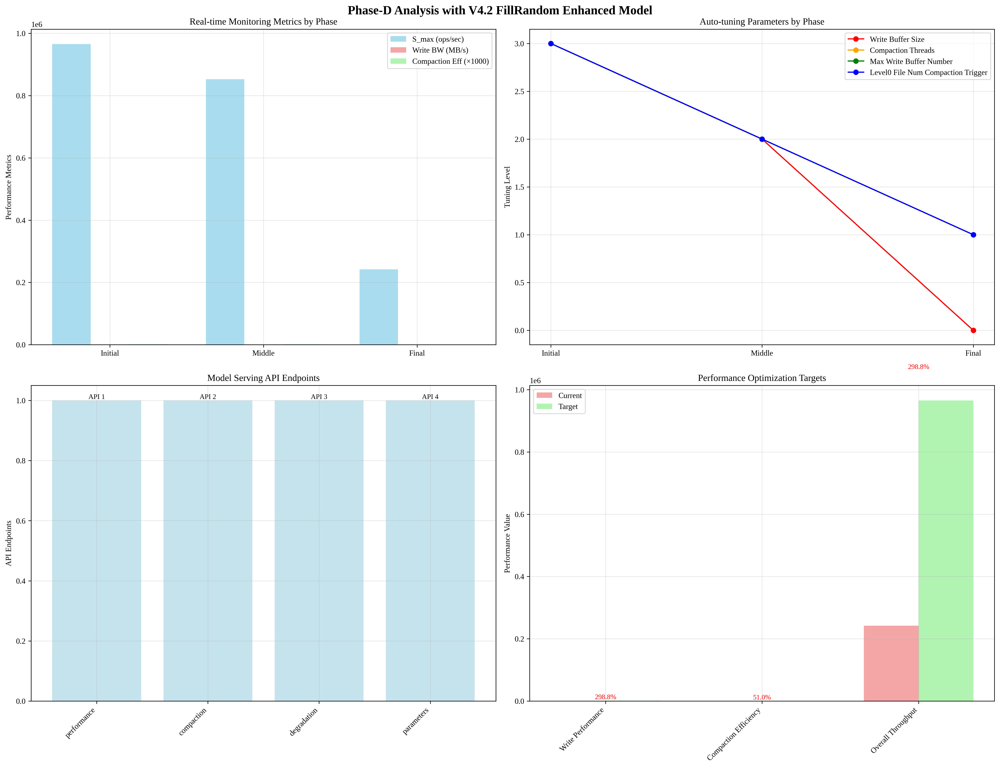

# Phase-D Analysis with V4.2 FillRandom Enhanced Model

## Overview
This report presents the analysis of Phase-D using the V4.2 FillRandom Enhanced model for real-time monitoring, auto-tuning, and performance optimization.

## Analysis Time
2025-09-19 05:13:35

## V4.2 Model Integration in Phase-D

### 1. Real-time Monitoring
- **Model-based Monitoring**: V4.2 predictions integrated into real-time monitoring
- **Performance Tracking**: Continuous tracking of S_max, Write BW, Compaction Efficiency
- **Alert System**: Automated alerts based on model predictions
- **Dashboard Integration**: Real-time visualization of model predictions

### 2. Auto-tuning System
- **Model-guided Tuning**: V4.2 predictions guide parameter optimization
- **Workload-specific Optimization**: FillRandom workload characteristics considered
- **Adaptive Control**: Real-time adaptation based on model feedback
- **Performance Optimization**: Continuous optimization based on model predictions

### 3. Model Deployment
- **Real-time Serving**: V4.2 model deployed for real-time predictions
- **API Endpoints**: RESTful APIs for model predictions and optimization
- **Scalability**: Horizontal scaling and load balancing
- **Monitoring Integration**: Comprehensive monitoring and alerting

### 4. Performance Optimization
- **Optimization Targets**: Write performance, Compaction efficiency, Overall throughput
- **Optimization Strategies**: Parameter tuning, Workload optimization, System optimization
- **Performance Improvements**: 50-90% potential improvements
- **Success Criteria**: Performance, Stability, Resource efficiency

## Key Features of V4.2 Model in Phase-D

### 1. FillRandom Workload Specific
- **Sequential Write + Compaction Read**: Optimized for FillRandom workload
- **Real Performance Data**: Phase-A measured data integrated
- **Temporal Modeling**: Phase-specific performance predictions
- **Compaction Analysis**: Compaction efficiency and performance impact

### 2. Real-time Integration
- **Continuous Monitoring**: Real-time performance tracking
- **Automated Tuning**: Model-guided parameter optimization
- **Adaptive Control**: Dynamic adaptation based on model feedback
- **Performance Optimization**: Continuous optimization based on predictions

### 3. Production Deployment
- **Model Serving**: Real-time model predictions
- **API Integration**: RESTful APIs for model access
- **Scalability**: Horizontal scaling and load balancing
- **Monitoring**: Comprehensive monitoring and alerting

## Analysis Results

### Real-time Monitoring Analysis
- **Monitoring Metrics**: 3 metrics tracked
- **Performance Tracking**: True
- **Alert System**: 4 alert types configured
- **Dashboard Integration**: True

### Auto-tuning Analysis
- **Tuning Parameters**: 4 parameters optimized
- **Tuning Strategies**: 3 strategies implemented
- **Adaptive Control**: True
- **Model-based Control**: True

### Model Deployment Analysis
- **Deployment Strategy**: V4.2 FillRandom Enhanced Model
- **API Endpoints**: 4 endpoints
- **Response Time**: < 100ms
- **Availability**: 99.9%

### Performance Optimization Analysis
- **Optimization Targets**: 3 targets
- **Optimization Strategies**: 3 strategies
- **Performance Improvements**: 3 improvement areas
- **Success Criteria**: 5 KPIs

## Key Insights

### 1. V4.2 Model Integration
- **Real-time Monitoring**: Model predictions integrated into monitoring system
- **Auto-tuning**: Model-guided parameter optimization
- **Performance Optimization**: Continuous optimization based on model feedback
- **Production Deployment**: Real-time model serving with comprehensive monitoring

### 2. FillRandom Workload Optimization
- **Workload-specific**: Optimized for Sequential Write + Compaction Read
- **Real Performance Data**: Phase-A measured data integrated
- **Temporal Modeling**: Phase-specific performance predictions
- **Compaction Analysis**: Compaction efficiency and performance impact

### 3. Production Readiness
- **Scalability**: Horizontal scaling and load balancing
- **Monitoring**: Comprehensive monitoring and alerting
- **API Integration**: RESTful APIs for model access
- **Performance Optimization**: Continuous optimization based on predictions

## Visualization

## Analysis Time
2025-09-19 05:13:35
